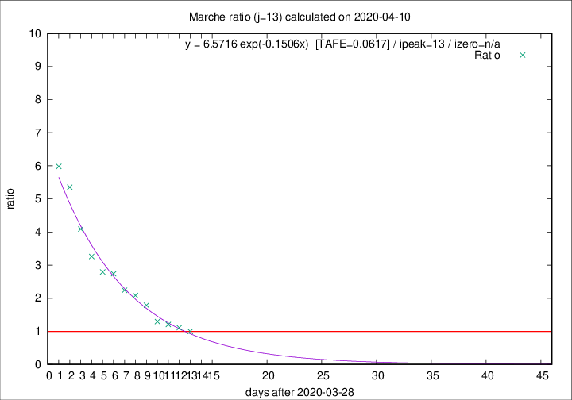

# Marche

Data source: https://raw.githubusercontent.com/pcm-dpc/COVID-19/master/dati-json/dpc-covid19-ita-regioni.json

Delta days analysis (j): 13

Analyses for other values of j for 2020-04-10 are avalable [here](../README.md)

Analyses for Marche for previous dates are avalable [here](../../README.md)

## Fitting 
|fit type|best fit equation|tafe|tfe|ipeak|izero|
|-------|-----|--------|------|---|---|
|exp|y = 6.5716 exp(-0.1506x)  [TAFE=0.0617]|0.0617|0.0027|13|n/a|

## Data
|Date|Daily deaths|Cumulated deaths|Deaths in the last 13 days|Deaths in the 13 days before|ratio|
|----|----------|-----------|-------|--------------------|-----|
|2020-04-10|13|682|318|318|1.0000|
|2020-04-09|17|669|333|300|1.1100|
|2020-04-08|22|652|342|283|1.2085|
|2020-04-07|18|630|343|265|1.2943|
|2020-04-06|13|612|381|213|1.7887|
|2020-04-05|25|599|396|190|2.0842|
|2020-04-04|17|574|390|174|2.2414|
|2020-04-03|54|557|403|147|2.7415|
|2020-04-02|26|503|366|131|2.7939|
|2020-04-01|25|477|362|111|3.2613|
|2020-03-31|35|452|360|88|4.0909|
|2020-03-30|31|417|348|65|5.3538|
|2020-03-29|22|386|329|55|5.9818|

[Download data as CSV](COVID-19_marche_j13_2020-04-10.csv)

Generated April 10th, 2020 at 17:26:10 UTC+0200 with https://github.com/robianc/COVID-19
