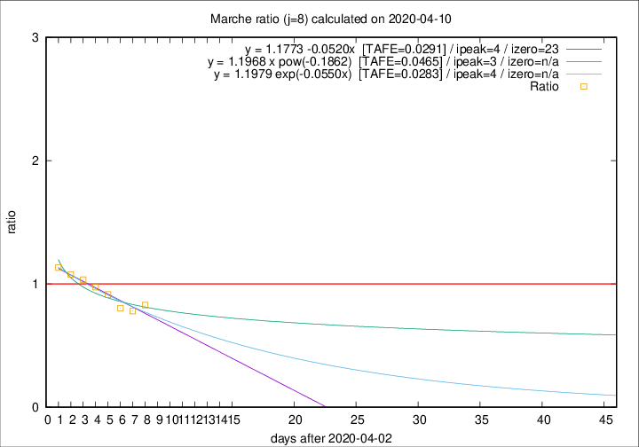

# Marche

Data source: https://raw.githubusercontent.com/pcm-dpc/COVID-19/master/dati-json/dpc-covid19-ita-regioni.json

Delta days analysis (j): 8

Analyses for other values of j for 2020-04-10 are avalable [here](../2020-04-10/README.md)

Analyses for Marche for previous dates are avalable [here](../README.md)

## Fitting 
|fit type|best fit equation|tafe|tfe|ipeak|izero|
|-------|-----|--------|------|---|---|
|linear|y = 1.1773 -0.0520x  [TAFE=0.0291]|0.0291|0.0016|4|23|
|exp|y = 1.1979 exp(-0.0550x)  [TAFE=0.0283]|0.0283|0.0010|4|n/a|
|pow|y = 1.1968 x pow(-0.1862)  [TAFE=0.0465]|0.0465|0.0012|3|n/a|

## Data
|Date|Daily deaths|Cumulated deaths|Deaths in the last 8 days|Deaths in the 8 days before|ratio|
|----|----------|-----------|-------|--------------------|-----|
|2020-04-10|13|682|179|216|0.8287|
|2020-04-09|17|669|192|246|0.7805|
|2020-04-08|22|652|200|249|0.8032|
|2020-04-07|18|630|213|233|0.9142|
|2020-04-06|13|612|226|232|0.9741|
|2020-04-05|25|599|235|227|1.0352|
|2020-04-04|17|574|238|221|1.0769|
|2020-04-03|54|557|247|218|1.1330|

[Download data as CSV](COVID-19_marche_j8_2020-04-10.csv)

Generated April 12th, 2020 at 17:02:01 UTC+0200 with https://github.com/robianc/COVID-19
