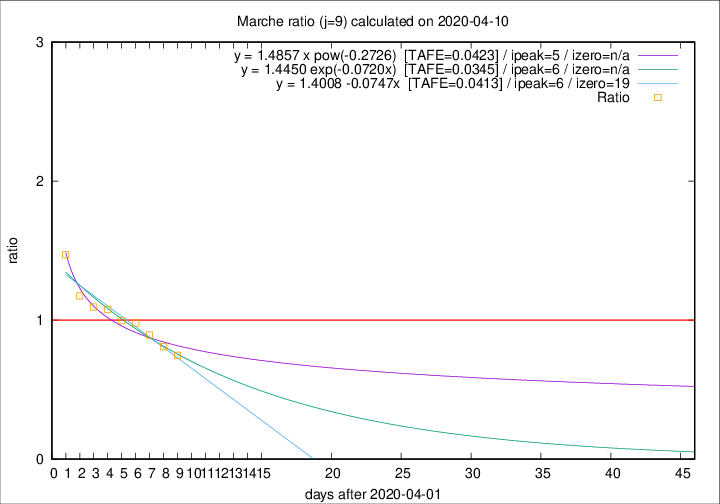

# Marche

Data source: https://raw.githubusercontent.com/pcm-dpc/COVID-19/master/dati-json/dpc-covid19-ita-regioni.json

Delta days analysis (j): 9

Analyses for other values of j for 2020-04-10 are avalable [here](../2020-04-10/README.md)

Analyses for Marche for previous dates are avalable [here](../README.md)

## Fitting 
|fit type|best fit equation|tafe|tfe|ipeak|izero|
|-------|-----|--------|------|---|---|
|linear|y = 1.4008 -0.0747x  [TAFE=0.0413]|0.0413|0.0018|6|19|
|exp|y = 1.4450 exp(-0.0720x)  [TAFE=0.0345]|0.0345|0.0009|6|n/a|
|pow|y = 1.4857 x pow(-0.2726)  [TAFE=0.0423]|0.0423|0.0012|5|n/a|

## Data
|Date|Daily deaths|Cumulated deaths|Deaths in the last 9 days|Deaths in the 9 days before|ratio|
|----|----------|-----------|-------|--------------------|-----|
|2020-04-10|13|682|205|274|0.7482|
|2020-04-09|17|669|217|268|0.8097|
|2020-04-08|22|652|235|263|0.8935|
|2020-04-07|18|630|244|249|0.9799|
|2020-04-06|13|612|248|249|0.9960|
|2020-04-05|25|599|263|244|1.0779|
|2020-04-04|17|574|264|241|1.0954|
|2020-04-03|54|557|270|230|1.1739|
|2020-04-02|26|503|272|185|1.4703|

[Download data as CSV](COVID-19_marche_j9_2020-04-10.csv)

Generated April 12th, 2020 at 17:02:01 UTC+0200 with https://github.com/robianc/COVID-19
