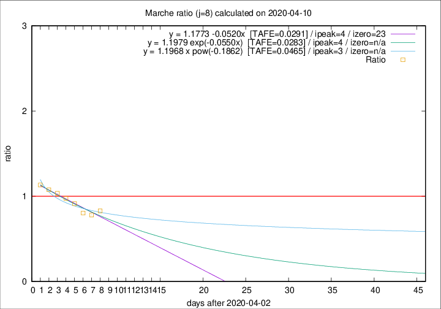

# Marche

Data source: https://raw.githubusercontent.com/pcm-dpc/COVID-19/master/dati-json/dpc-covid19-ita-regioni.json

Estimates in this page were made on 14/4/2020 with data available until 10/04/2020.

## Summary 

### Peak estimate 
|j|linear [TAFE]|exponential [TAFE]|power law [TAFE]|details|
|---|----|-----------|---------|-------|
|7|6/4/2020 [TAFE=0.0983]|6/4/2020 [TAFE=0.1002]|6/4/2020 [TAFE=0.1173]|[analysis](COVID-19_marche_j7_2020-04-10.md)|
|8|7/4/2020 [TAFE=0.0291]|7/4/2020 [TAFE=0.0283]|6/4/2020 [TAFE=0.0465]|[analysis](COVID-19_marche_j8_2020-04-10.md)|
|9|8/4/2020 [TAFE=0.0413]|8/4/2020 [TAFE=0.0345]|7/4/2020 [TAFE=0.0423]|[analysis](COVID-19_marche_j9_2020-04-10.md)|
|10|9/4/2020 [TAFE=0.0909]|9/4/2020 [TAFE=0.0626]|8/4/2020 [TAFE=0.0632]|[analysis](COVID-19_marche_j10_2020-04-10.md)|
|11|10/4/2020 [TAFE=0.1004]|10/4/2020 [TAFE=0.0647]|11/4/2020 [TAFE=0.0963]|[analysis](COVID-19_marche_j11_2020-04-10.md)|
|12|10/4/2020 [TAFE=0.1049]|10/4/2020 [TAFE=0.0517]|13/4/2020 [TAFE=0.1331]|[analysis](COVID-19_marche_j12_2020-04-10.md)|
|13|10/4/2020 [TAFE=0.1914]|11/4/2020 [TAFE=0.0617]|16/4/2020 [TAFE=0.1591]|[analysis](COVID-19_marche_j13_2020-04-10.md)|
|14|10/4/2020 [TAFE=0.2312]|12/4/2020 [TAFE=0.0419]|20/4/2020 [TAFE=0.1842]|[analysis](COVID-19_marche_j14_2020-04-10.md)|

Best estimator is exp with j=8 (TAFE=0.0283)
Corresponding peak date estimate is 7/4/2020 (ipeak 4)

Peak date range estimate: 5/4/2020 - 26/4/2020

### End estimate 
|j|linear [TAFE/TFE]|exponential [TAFE/TFE]|power law [TAFE/TFE]|details|
|---|----|-----------|---------|-------|
|7|23/4/2020 [TAFE=0.0983]|-|-|[analysis](COVID-19_marche_j7_2020-04-10.md)|
|8|26/4/2020 [TAFE=0.0291]|-|-|[analysis](COVID-19_marche_j8_2020-04-10.md)|
|9|-|-|-|[analysis](COVID-19_marche_j9_2020-04-10.md)|
|10|-|-|-|[analysis](COVID-19_marche_j10_2020-04-10.md)|
|11|-|-|-|[analysis](COVID-19_marche_j11_2020-04-10.md)|
|12|-|-|-|[analysis](COVID-19_marche_j12_2020-04-10.md)|
|13|-|-|-|[analysis](COVID-19_marche_j13_2020-04-10.md)|
|14|-|-|-|[analysis](COVID-19_marche_j14_2020-04-10.md)|

Best estimator is linear with j=8 (TAFE=0.0291)
Corresponding end date estimate is 26/4/2020 (izero 23)

End date range estimate: 3/4/2020 - 26/4/2020

Generated April 14th, 2020 at 19:16:04 UTC+0200 with https://github.com/robianc/COVID-19
