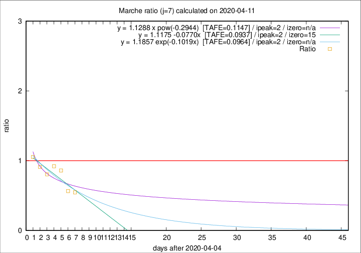

# Marche

Data source: https://raw.githubusercontent.com/pcm-dpc/COVID-19/master/dati-json/dpc-covid19-ita-regioni.json

Delta days analysis (j): 7

Analyses for other values of j for 2020-04-11 are avalable [here](../2020-04-11/README.md)

Analyses for Marche for previous dates are avalable [here](../README.md)

## Fitting 
|fit type|best fit equation|tafe|tfe|ipeak|izero|
|-------|-----|--------|------|---|---|
|linear|y = 1.1175 -0.0770x  [TAFE=0.0937]|0.0937|0.0129|2|15|
|exp|y = 1.1857 exp(-0.1019x)  [TAFE=0.0964]|0.0964|0.0063|2|n/a|
|pow|y = 1.1288 x pow(-0.2944)  [TAFE=0.1147]|0.1147|0.0095|2|n/a|

## Data
|Date|Daily deaths|Cumulated deaths|Deaths in the last 7 days|Deaths in the 7 days before|ratio|
|----|----------|-----------|-------|--------------------|-----|
|2020-04-11|7|689|115|210|0.5476|
|2020-04-10|13|682|125|221|0.5656|
|2020-04-09|17|669|166|193|0.8601|
|2020-04-08|22|652|175|190|0.9211|
|2020-04-07|18|630|178|221|0.8054|
|2020-04-06|13|612|195|214|0.9112|
|2020-04-05|25|599|213|202|1.0545|

[Download data as CSV](COVID-19_marche_j7_2020-04-11.csv)

Generated April 12th, 2020 at 17:02:01 UTC+0200 with https://github.com/robianc/COVID-19
