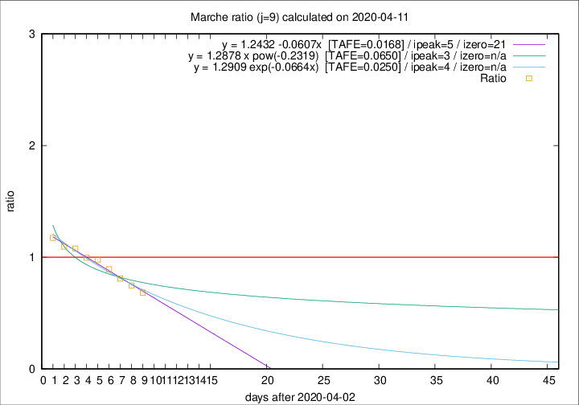

# Marche

Data source: https://raw.githubusercontent.com/pcm-dpc/COVID-19/master/dati-json/dpc-covid19-ita-regioni.json

Estimates in this page were made on 19/4/2020 with data available until 11/04/2020.

## Summary 

### Peak estimate 
|j|linear [TAFE]|exponential [TAFE]|power law [TAFE]|details|
|---|----|-----------|---------|-------|
|7|7/4/2020 [TAFE=0.0937]|7/4/2020 [TAFE=0.0964]|7/4/2020 [TAFE=0.1147]|[analysis](COVID-19_marche_j7_2020-04-11.md)|
|8|7/4/2020 [TAFE=0.0553]|7/4/2020 [TAFE=0.0641]|7/4/2020 [TAFE=0.0979]|[analysis](COVID-19_marche_j8_2020-04-11.md)|
|9|8/4/2020 [TAFE=0.0168]|7/4/2020 [TAFE=0.0250]|6/4/2020 [TAFE=0.0650]|[analysis](COVID-19_marche_j9_2020-04-11.md)|
|10|9/4/2020 [TAFE=0.0885]|9/4/2020 [TAFE=0.0632]|8/4/2020 [TAFE=0.0609]|[analysis](COVID-19_marche_j10_2020-04-11.md)|
|11|10/4/2020 [TAFE=0.1095]|10/4/2020 [TAFE=0.0673]|10/4/2020 [TAFE=0.0718]|[analysis](COVID-19_marche_j11_2020-04-11.md)|
|12|10/4/2020 [TAFE=0.0981]|11/4/2020 [TAFE=0.0552]|12/4/2020 [TAFE=0.1237]|[analysis](COVID-19_marche_j12_2020-04-11.md)|
|13|11/4/2020 [TAFE=0.1821]|11/4/2020 [TAFE=0.0609]|14/4/2020 [TAFE=0.1360]|[analysis](COVID-19_marche_j13_2020-04-11.md)|
|14|11/4/2020 [TAFE=0.2340]|12/4/2020 [TAFE=0.0451]|18/4/2020 [TAFE=0.1866]|[analysis](COVID-19_marche_j14_2020-04-11.md)|

Best estimator is linear with j=9 (TAFE=0.0168)
Corresponding peak date estimate is 8/4/2020 (ipeak 5)

Peak date range estimate: 5/4/2020 - 23/4/2020

### End estimate 
|j|linear [TAFE/TFE]|exponential [TAFE/TFE]|power law [TAFE/TFE]|details|
|---|----|-----------|---------|-------|
|7|20/4/2020 [TAFE=0.0937]|-|-|[analysis](COVID-19_marche_j7_2020-04-11.md)|
|8|22/4/2020 [TAFE=0.0553]|-|-|[analysis](COVID-19_marche_j8_2020-04-11.md)|
|9|24/4/2020 [TAFE=0.0168]|-|-|[analysis](COVID-19_marche_j9_2020-04-11.md)|
|10|-|-|-|[analysis](COVID-19_marche_j10_2020-04-11.md)|
|11|-|-|-|[analysis](COVID-19_marche_j11_2020-04-11.md)|
|12|-|-|-|[analysis](COVID-19_marche_j12_2020-04-11.md)|
|13|-|-|-|[analysis](COVID-19_marche_j13_2020-04-11.md)|
|14|-|-|-|[analysis](COVID-19_marche_j14_2020-04-11.md)|

Best estimator is linear with j=9 (TAFE=0.0168)
Corresponding end date estimate is 24/4/2020 (izero 21)

End date range estimate: 3/4/2020 - 24/4/2020

Generated April 19th, 2020 at 18:42:39 UTC+0200 with https://github.com/robianc/COVID-19
