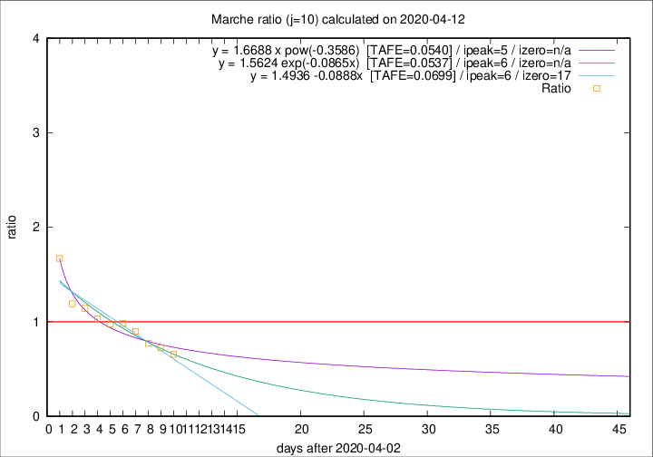

# Marche

Data source: https://raw.githubusercontent.com/pcm-dpc/COVID-19/master/dati-json/dpc-covid19-ita-regioni.json

Delta days analysis (j): 10

Analyses for other values of j for 2020-04-12 are avalable [here](../2020-04-12/README.md)

Analyses for Marche for previous dates are avalable [here](../README.md)

## Fitting 
|fit type|best fit equation|tafe|tfe|ipeak|izero|
|-------|-----|--------|------|---|---|
|linear|y = 1.4936 -0.0888x  [TAFE=0.0699]|0.0699|0.0039|6|17|
|exp|y = 1.5624 exp(-0.0865x)  [TAFE=0.0537]|0.0537|0.0023|6|n/a|
|pow|y = 1.6688 x pow(-0.3586)  [TAFE=0.0540]|0.0540|0.0021|5|n/a|

## Data
|Date|Daily deaths|Cumulated deaths|Deaths in the last 10 days|Deaths in the 10 days before|ratio|
|----|----------|-----------|-------|--------------------|-----|
|2020-04-12|11|700|197|300|0.6567|
|2020-04-11|7|689|212|293|0.7235|
|2020-04-10|13|682|230|298|0.7718|
|2020-04-09|17|669|252|280|0.9000|
|2020-04-08|22|652|266|271|0.9815|
|2020-04-07|18|630|266|272|0.9779|
|2020-04-06|13|612|276|267|1.0337|
|2020-04-05|25|599|289|253|1.1423|
|2020-04-04|17|574|287|241|1.1909|
|2020-04-03|54|557|326|195|1.6718|

[Download data as CSV](COVID-19_marche_j10_2020-04-12.csv)

Generated April 16th, 2020 at 20:09:19 UTC+0200 with https://github.com/robianc/COVID-19
