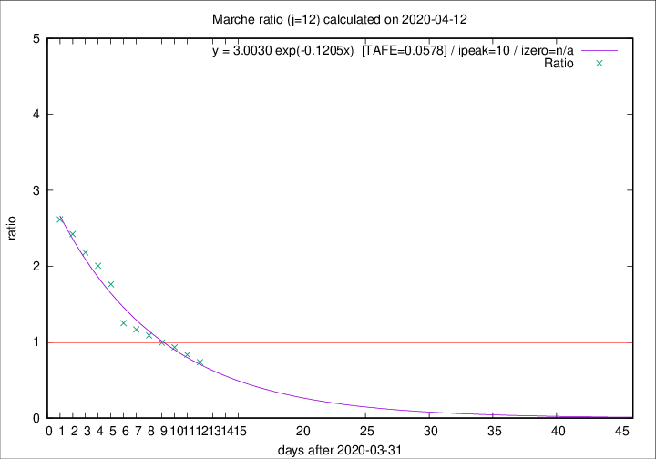

# Marche

Data source: https://raw.githubusercontent.com/pcm-dpc/COVID-19/master/dati-json/dpc-covid19-ita-regioni.json

Delta days analysis (j): 12

Analyses for other values of j for 2020-04-12 are avalable [here](../2020-04-12/README.md)

Analyses for Marche for previous dates are avalable [here](../README.md)

## Fitting 
|fit type|best fit equation|tafe|tfe|ipeak|izero|
|-------|-----|--------|------|---|---|
|exp|y = 3.0030 exp(-0.1205x)  [TAFE=0.0578]|0.0578|0.0027|10|n/a|

## Data
|Date|Daily deaths|Cumulated deaths|Deaths in the last 12 days|Deaths in the 12 days before|ratio|
|----|----------|-----------|-------|--------------------|-----|
|2020-04-12|11|700|248|337|0.7359|
|2020-04-11|7|689|272|325|0.8369|
|2020-04-10|13|682|296|317|0.9338|
|2020-04-09|17|669|305|307|0.9935|
|2020-04-08|22|652|316|290|1.0897|
|2020-04-07|18|630|320|274|1.1679|
|2020-04-06|13|612|325|260|1.2500|
|2020-04-05|25|599|368|209|1.7608|
|2020-04-04|17|574|371|185|2.0054|
|2020-04-03|54|557|373|171|2.1813|
|2020-04-02|26|503|349|144|2.4236|
|2020-04-01|25|477|340|130|2.6154|

[Download data as CSV](COVID-19_marche_j12_2020-04-12.csv)

Generated April 19th, 2020 at 18:42:39 UTC+0200 with https://github.com/robianc/COVID-19
