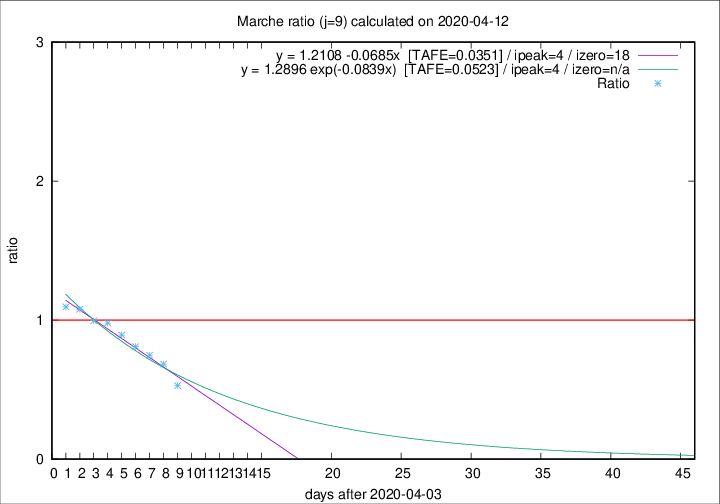

# Marche

Data source: https://raw.githubusercontent.com/pcm-dpc/COVID-19/master/dati-json/dpc-covid19-ita-regioni.json

Estimates in this page were made on 16/4/2020 with data available until 12/04/2020.

## Summary 

### Peak estimate 
|j|linear [TAFE]|exponential [TAFE]|power law [TAFE]|details|
|---|----|-----------|---------|-------|
|7|8/4/2020 [TAFE=0.0943]|8/4/2020 [TAFE=0.0992]|8/4/2020 [TAFE=0.1353]|[analysis](COVID-19_marche_j7_2020-04-12.md)|
|8|7/4/2020 [TAFE=0.0567]|7/4/2020 [TAFE=0.0669]|7/4/2020 [TAFE=0.1172]|[analysis](COVID-19_marche_j8_2020-04-12.md)|
|9|8/4/2020 [TAFE=0.0351]|8/4/2020 [TAFE=0.0523]|7/4/2020 [TAFE=0.0976]|[analysis](COVID-19_marche_j9_2020-04-12.md)|
|10|9/4/2020 [TAFE=0.0699]|9/4/2020 [TAFE=0.0537]|8/4/2020 [TAFE=0.0540]|[analysis](COVID-19_marche_j10_2020-04-12.md)|
|11|10/4/2020 [TAFE=0.1042]|10/4/2020 [TAFE=0.0619]|9/4/2020 [TAFE=0.0773]|[analysis](COVID-19_marche_j11_2020-04-12.md)|
|12|11/4/2020 [TAFE=0.1128]|11/4/2020 [TAFE=0.0578]|11/4/2020 [TAFE=0.1058]|[analysis](COVID-19_marche_j12_2020-04-12.md)|
|13|11/4/2020 [TAFE=0.1432]|11/4/2020 [TAFE=0.0533]|13/4/2020 [TAFE=0.1396]|[analysis](COVID-19_marche_j13_2020-04-12.md)|
|14|11/4/2020 [TAFE=0.2339]|12/4/2020 [TAFE=0.0500]|16/4/2020 [TAFE=0.1700]|[analysis](COVID-19_marche_j14_2020-04-12.md)|

Best estimator is linear with j=9 (TAFE=0.0351)
Corresponding peak date estimate is 8/4/2020 (ipeak 4)

Peak date range estimate: 6/4/2020 - 21/4/2020

### End estimate 
|j|linear [TAFE/TFE]|exponential [TAFE/TFE]|power law [TAFE/TFE]|details|
|---|----|-----------|---------|-------|
|7|20/4/2020 [TAFE=0.0943]|-|-|[analysis](COVID-19_marche_j7_2020-04-12.md)|
|8|21/4/2020 [TAFE=0.0567]|-|-|[analysis](COVID-19_marche_j8_2020-04-12.md)|
|9|22/4/2020 [TAFE=0.0351]|-|-|[analysis](COVID-19_marche_j9_2020-04-12.md)|
|10|-|-|-|[analysis](COVID-19_marche_j10_2020-04-12.md)|
|11|-|-|-|[analysis](COVID-19_marche_j11_2020-04-12.md)|
|12|-|-|-|[analysis](COVID-19_marche_j12_2020-04-12.md)|
|13|-|-|-|[analysis](COVID-19_marche_j13_2020-04-12.md)|
|14|-|-|-|[analysis](COVID-19_marche_j14_2020-04-12.md)|

Best estimator is linear with j=9 (TAFE=0.0351)
Corresponding end date estimate is 22/4/2020 (izero 18)

End date range estimate: 4/4/2020 - 22/4/2020

Generated April 16th, 2020 at 20:09:19 UTC+0200 with https://github.com/robianc/COVID-19
