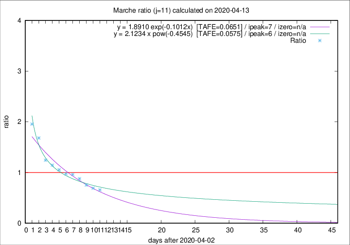

# Marche

Data source: https://raw.githubusercontent.com/pcm-dpc/COVID-19/master/dati-json/dpc-covid19-ita-regioni.json

Delta days analysis (j): 11

Analyses for other values of j for 2020-04-13 are avalable [here](../2020-04-13/README.md)

Analyses for Marche for previous dates are avalable [here](../README.md)

## Fitting 
|fit type|best fit equation|tafe|tfe|ipeak|izero|
|-------|-----|--------|------|---|---|
|exp|y = 1.8910 exp(-0.1012x)  [TAFE=0.0651]|0.0651|0.0029|7|n/a|
|pow|y = 2.1234 x pow(-0.4545)  [TAFE=0.0575]|0.0575|0.0019|6|n/a|

## Data
|Date|Daily deaths|Cumulated deaths|Deaths in the last 11 days|Deaths in the 11 days before|ratio|
|----|----------|-----------|-------|--------------------|-----|
|2020-04-13|13|713|210|319|0.6583|
|2020-04-12|11|700|223|323|0.6904|
|2020-04-11|7|689|237|315|0.7524|
|2020-04-10|13|682|265|302|0.8775|
|2020-04-09|17|669|283|294|0.9626|
|2020-04-08|22|652|288|295|0.9763|
|2020-04-07|18|630|294|279|1.0538|
|2020-04-06|13|612|302|264|1.1439|
|2020-04-05|25|599|312|251|1.2430|
|2020-04-04|17|574|343|204|1.6814|
|2020-04-03|54|557|354|181|1.9558|

[Download data as CSV](COVID-19_marche_j11_2020-04-13.csv)

Generated April 19th, 2020 at 18:42:39 UTC+0200 with https://github.com/robianc/COVID-19
