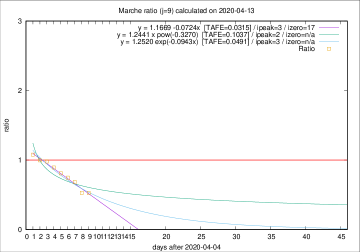

# Marche

Data source: https://raw.githubusercontent.com/pcm-dpc/COVID-19/master/dati-json/dpc-covid19-ita-regioni.json

Estimates in this page were made on 14/4/2020 with data available until 13/04/2020.

## Summary 

### Peak estimate 
|j|linear [TAFE]|exponential [TAFE]|power law [TAFE]|details|
|---|----|-----------|---------|-------|
|7|9/4/2020 [TAFE=0.1234]|9/4/2020 [TAFE=0.1153]|9/4/2020 [TAFE=0.1220]|[analysis](COVID-19_marche_j7_2020-04-13.md)|
|8|8/4/2020 [TAFE=0.0571]|8/4/2020 [TAFE=0.0619]|8/4/2020 [TAFE=0.1142]|[analysis](COVID-19_marche_j8_2020-04-13.md)|
|9|8/4/2020 [TAFE=0.0315]|8/4/2020 [TAFE=0.0491]|7/4/2020 [TAFE=0.1037]|[analysis](COVID-19_marche_j9_2020-04-13.md)|
|10|8/4/2020 [TAFE=0.0427]|8/4/2020 [TAFE=0.0635]|7/4/2020 [TAFE=0.1104]|[analysis](COVID-19_marche_j10_2020-04-13.md)|
|11|10/4/2020 [TAFE=0.1023]|10/4/2020 [TAFE=0.0651]|9/4/2020 [TAFE=0.0575]|[analysis](COVID-19_marche_j11_2020-04-13.md)|
|12|11/4/2020 [TAFE=0.1252]|11/4/2020 [TAFE=0.0617]|10/4/2020 [TAFE=0.0862]|[analysis](COVID-19_marche_j12_2020-04-13.md)|
|13|12/4/2020 [TAFE=0.1353]|12/4/2020 [TAFE=0.0507]|12/4/2020 [TAFE=0.1308]|[analysis](COVID-19_marche_j13_2020-04-13.md)|
|14|12/4/2020 [TAFE=0.2197]|12/4/2020 [TAFE=0.0518]|15/4/2020 [TAFE=0.1465]|[analysis](COVID-19_marche_j14_2020-04-13.md)|

Best estimator is linear with j=9 (TAFE=0.0315)
Corresponding peak date estimate is 8/4/2020 (ipeak 3)

Peak date range estimate: 7/4/2020 - 20/4/2020

### End estimate 
|j|linear [TAFE/TFE]|exponential [TAFE/TFE]|power law [TAFE/TFE]|details|
|---|----|-----------|---------|-------|
|7|21/4/2020 [TAFE=0.1234]|-|-|[analysis](COVID-19_marche_j7_2020-04-13.md)|
|8|21/4/2020 [TAFE=0.0571]|-|-|[analysis](COVID-19_marche_j8_2020-04-13.md)|
|9|22/4/2020 [TAFE=0.0315]|-|-|[analysis](COVID-19_marche_j9_2020-04-13.md)|
|10|-|-|-|[analysis](COVID-19_marche_j10_2020-04-13.md)|
|11|-|-|-|[analysis](COVID-19_marche_j11_2020-04-13.md)|
|12|-|-|-|[analysis](COVID-19_marche_j12_2020-04-13.md)|
|13|-|-|-|[analysis](COVID-19_marche_j13_2020-04-13.md)|
|14|-|-|-|[analysis](COVID-19_marche_j14_2020-04-13.md)|

Best estimator is linear with j=9 (TAFE=0.0315)
Corresponding end date estimate is 22/4/2020 (izero 17)

End date range estimate: 5/4/2020 - 23/4/2020

Generated April 14th, 2020 at 19:16:04 UTC+0200 with https://github.com/robianc/COVID-19
