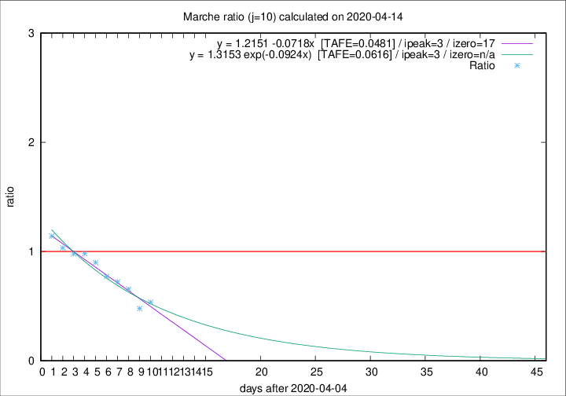

# Marche

Data source: https://raw.githubusercontent.com/pcm-dpc/COVID-19/master/dati-json/dpc-covid19-ita-regioni.json

Delta days analysis (j): 10

Analyses for other values of j for 2020-04-14 are avalable [here](../2020-04-14/README.md)

Analyses for Marche for previous dates are avalable [here](../README.md)

## Fitting 
|fit type|best fit equation|tafe|tfe|ipeak|izero|
|-------|-----|--------|------|---|---|
|linear|y = 1.2151 -0.0718x  [TAFE=0.0481]|0.0481|0.0048|3|17|
|exp|y = 1.3153 exp(-0.0924x)  [TAFE=0.0616]|0.0616|0.0031|3|n/a|

## Data
|Date|Daily deaths|Cumulated deaths|Deaths in the last 10 days|Deaths in the 10 days before|ratio|
|----|----------|-----------|-------|--------------------|-----|
|2020-04-14|15|728|154|287|0.5366|
|2020-04-13|13|713|156|326|0.4785|
|2020-04-12|11|700|197|300|0.6567|
|2020-04-11|7|689|212|293|0.7235|
|2020-04-10|13|682|230|298|0.7718|
|2020-04-09|17|669|252|280|0.9000|
|2020-04-08|22|652|266|271|0.9815|
|2020-04-07|18|630|266|272|0.9779|
|2020-04-06|13|612|276|267|1.0337|
|2020-04-05|25|599|289|253|1.1423|

[Download data as CSV](COVID-19_marche_j10_2020-04-14.csv)

Generated April 19th, 2020 at 18:42:39 UTC+0200 with https://github.com/robianc/COVID-19
