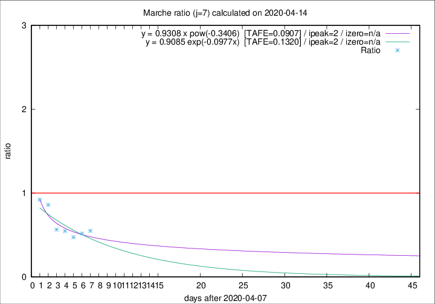

# Marche

Data source: https://raw.githubusercontent.com/pcm-dpc/COVID-19/master/dati-json/dpc-covid19-ita-regioni.json

Delta days analysis (j): 7

Analyses for other values of j for 2020-04-14 are avalable [here](../2020-04-14/README.md)

Analyses for Marche for previous dates are avalable [here](../README.md)

## Fitting 
|fit type|best fit equation|tafe|tfe|ipeak|izero|
|-------|-----|--------|------|---|---|
|exp|y = 0.9085 exp(-0.0977x)  [TAFE=0.1320]|0.1320|0.0097|2|n/a|
|pow|y = 0.9308 x pow(-0.3406)  [TAFE=0.0907]|0.0907|0.0056|2|n/a|

## Data
|Date|Daily deaths|Cumulated deaths|Deaths in the last 7 days|Deaths in the 7 days before|ratio|
|----|----------|-----------|-------|--------------------|-----|
|2020-04-14|15|728|98|178|0.5506|
|2020-04-13|13|713|101|195|0.5179|
|2020-04-12|11|700|101|213|0.4742|
|2020-04-11|7|689|115|210|0.5476|
|2020-04-10|13|682|125|221|0.5656|
|2020-04-09|17|669|166|193|0.8601|
|2020-04-08|22|652|175|190|0.9211|

[Download data as CSV](COVID-19_marche_j7_2020-04-14.csv)

Generated April 14th, 2020 at 19:16:04 UTC+0200 with https://github.com/robianc/COVID-19
