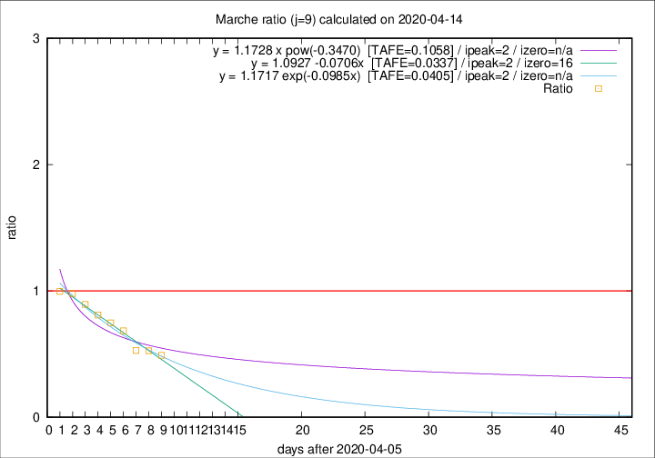

# Marche

Data source: https://raw.githubusercontent.com/pcm-dpc/COVID-19/master/dati-json/dpc-covid19-ita-regioni.json

Estimates in this page were made on 19/4/2020 with data available until 14/04/2020.

## Summary 

### Peak estimate 
|j|linear [TAFE]|exponential [TAFE]|power law [TAFE]|details|
|---|----|-----------|---------|-------|
|7|10/4/2020 [TAFE=0.1490]|10/4/2020 [TAFE=0.1320]|10/4/2020 [TAFE=0.0907]|[analysis](COVID-19_marche_j7_2020-04-14.md)|
|8|9/4/2020 [TAFE=0.0861]|9/4/2020 [TAFE=0.0787]|9/4/2020 [TAFE=0.0884]|[analysis](COVID-19_marche_j8_2020-04-14.md)|
|9|8/4/2020 [TAFE=0.0337]|8/4/2020 [TAFE=0.0405]|8/4/2020 [TAFE=0.1058]|[analysis](COVID-19_marche_j9_2020-04-14.md)|
|10|8/4/2020 [TAFE=0.0481]|8/4/2020 [TAFE=0.0616]|8/4/2020 [TAFE=0.1127]|[analysis](COVID-19_marche_j10_2020-04-14.md)|
|11|10/4/2020 [TAFE=0.0603]|10/4/2020 [TAFE=0.0665]|8/4/2020 [TAFE=0.0844]|[analysis](COVID-19_marche_j11_2020-04-14.md)|
|12|11/4/2020 [TAFE=0.1288]|11/4/2020 [TAFE=0.0640]|10/4/2020 [TAFE=0.0765]|[analysis](COVID-19_marche_j12_2020-04-14.md)|
|13|12/4/2020 [TAFE=0.1414]|12/4/2020 [TAFE=0.0558]|12/4/2020 [TAFE=0.1141]|[analysis](COVID-19_marche_j13_2020-04-14.md)|
|14|13/4/2020 [TAFE=0.1829]|13/4/2020 [TAFE=0.0481]|14/4/2020 [TAFE=0.1450]|[analysis](COVID-19_marche_j14_2020-04-14.md)|

Best estimator is linear with j=9 (TAFE=0.0337)
Corresponding peak date estimate is 8/4/2020 (ipeak 2)

Peak date range estimate: 8/4/2020 - 19/4/2020

### End estimate 
|j|linear [TAFE/TFE]|exponential [TAFE/TFE]|power law [TAFE/TFE]|details|
|---|----|-----------|---------|-------|
|7|22/4/2020 [TAFE=0.1490]|-|-|[analysis](COVID-19_marche_j7_2020-04-14.md)|
|8|22/4/2020 [TAFE=0.0861]|-|-|[analysis](COVID-19_marche_j8_2020-04-14.md)|
|9|22/4/2020 [TAFE=0.0337]|-|-|[analysis](COVID-19_marche_j9_2020-04-14.md)|
|10|-|-|-|[analysis](COVID-19_marche_j10_2020-04-14.md)|
|11|-|-|-|[analysis](COVID-19_marche_j11_2020-04-14.md)|
|12|-|-|-|[analysis](COVID-19_marche_j12_2020-04-14.md)|
|13|-|-|-|[analysis](COVID-19_marche_j13_2020-04-14.md)|
|14|-|-|-|[analysis](COVID-19_marche_j14_2020-04-14.md)|

Best estimator is linear with j=9 (TAFE=0.0337)
Corresponding end date estimate is 22/4/2020 (izero 16)

End date range estimate: 6/4/2020 - 23/4/2020

Generated April 19th, 2020 at 18:42:39 UTC+0200 with https://github.com/robianc/COVID-19
