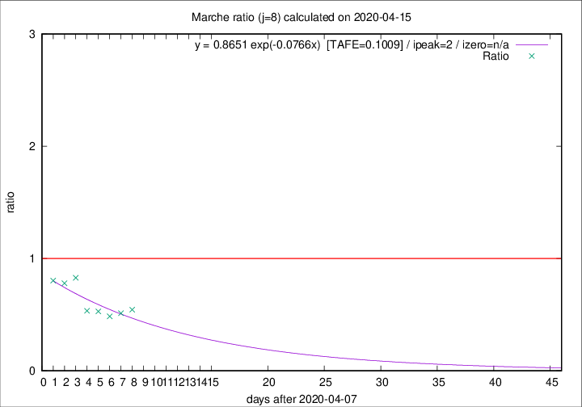

# Marche

Data source: https://raw.githubusercontent.com/pcm-dpc/COVID-19/master/dati-json/dpc-covid19-ita-regioni.json

Delta days analysis (j): 8

Analyses for other values of j for 2020-04-15 are avalable [here](../2020-04-15/README.md)

Analyses for Marche for previous dates are avalable [here](../README.md)

## Fitting 
|fit type|best fit equation|tafe|tfe|ipeak|izero|
|-------|-----|--------|------|---|---|
|exp|y = 0.8651 exp(-0.0766x)  [TAFE=0.1009]|0.1009|0.0071|2|n/a|

## Data
|Date|Daily deaths|Cumulated deaths|Deaths in the last 8 days|Deaths in the 8 days before|ratio|
|----|----------|-----------|-------|--------------------|-----|
|2020-04-15|18|746|116|213|0.5446|
|2020-04-14|15|728|116|226|0.5133|
|2020-04-13|13|713|114|235|0.4851|
|2020-04-12|11|700|126|238|0.5294|
|2020-04-11|7|689|132|247|0.5344|
|2020-04-10|13|682|179|216|0.8287|
|2020-04-09|17|669|192|246|0.7805|
|2020-04-08|22|652|200|249|0.8032|

[Download data as CSV](COVID-19_marche_j8_2020-04-15.csv)

Generated April 16th, 2020 at 20:09:19 UTC+0200 with https://github.com/robianc/COVID-19
