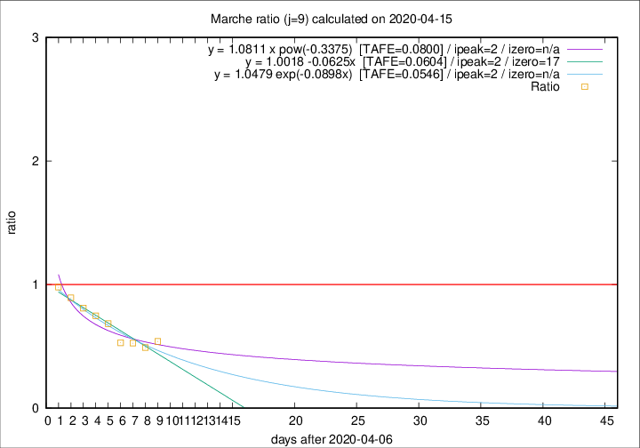

# Marche

Data source: https://raw.githubusercontent.com/pcm-dpc/COVID-19/master/dati-json/dpc-covid19-ita-regioni.json

Delta days analysis (j): 9

Analyses for other values of j for 2020-04-15 are avalable [here](../2020-04-15/README.md)

Analyses for Marche for previous dates are avalable [here](../README.md)

## Fitting 
|fit type|best fit equation|tafe|tfe|ipeak|izero|
|-------|-----|--------|------|---|---|
|linear|y = 1.0018 -0.0625x  [TAFE=0.0604]|0.0604|0.0055|2|17|
|exp|y = 1.0479 exp(-0.0898x)  [TAFE=0.0546]|0.0546|0.0026|2|n/a|
|pow|y = 1.0811 x pow(-0.3375)  [TAFE=0.0800]|0.0800|0.0035|2|n/a|

## Data
|Date|Daily deaths|Cumulated deaths|Deaths in the last 9 days|Deaths in the 9 days before|ratio|
|----|----------|-----------|-------|--------------------|-----|
|2020-04-15|18|746|134|248|0.5403|
|2020-04-14|15|728|129|263|0.4905|
|2020-04-13|13|713|139|264|0.5265|
|2020-04-12|11|700|143|270|0.5296|
|2020-04-11|7|689|186|272|0.6838|
|2020-04-10|13|682|205|274|0.7482|
|2020-04-09|17|669|217|268|0.8097|
|2020-04-08|22|652|235|263|0.8935|
|2020-04-07|18|630|244|249|0.9799|

[Download data as CSV](COVID-19_marche_j9_2020-04-15.csv)

Generated April 16th, 2020 at 20:09:19 UTC+0200 with https://github.com/robianc/COVID-19
