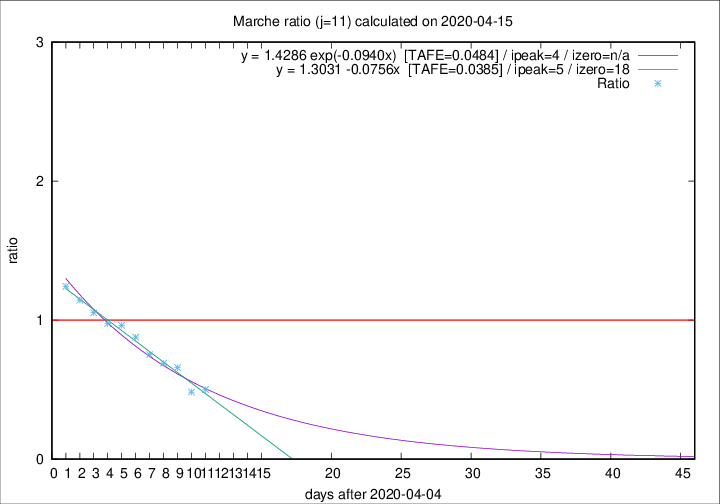

# Marche

Data source: https://raw.githubusercontent.com/pcm-dpc/COVID-19/master/dati-json/dpc-covid19-ita-regioni.json

Estimates in this page were made on 19/4/2020 with data available until 15/04/2020.

## Summary 

### Peak estimate 
|j|linear [TAFE]|exponential [TAFE]|power law [TAFE]|details|
|---|----|-----------|---------|-------|
|7|11/4/2020 [TAFE=0.1363]|11/4/2020 [TAFE=0.1220]|11/4/2020 [TAFE=0.0975]|[analysis](COVID-19_marche_j7_2020-04-15.md)|
|8|10/4/2020 [TAFE=0.1097]|10/4/2020 [TAFE=0.1009]|10/4/2020 [TAFE=0.0975]|[analysis](COVID-19_marche_j8_2020-04-15.md)|
|9|9/4/2020 [TAFE=0.0604]|9/4/2020 [TAFE=0.0546]|9/4/2020 [TAFE=0.0800]|[analysis](COVID-19_marche_j9_2020-04-15.md)|
|10|8/4/2020 [TAFE=0.0535]|9/4/2020 [TAFE=0.0587]|8/4/2020 [TAFE=0.1124]|[analysis](COVID-19_marche_j10_2020-04-15.md)|
|11|10/4/2020 [TAFE=0.0385]|9/4/2020 [TAFE=0.0484]|8/4/2020 [TAFE=0.1135]|[analysis](COVID-19_marche_j11_2020-04-15.md)|
|12|11/4/2020 [TAFE=0.1179]|11/4/2020 [TAFE=0.0618]|10/4/2020 [TAFE=0.0785]|[analysis](COVID-19_marche_j12_2020-04-15.md)|
|13|13/4/2020 [TAFE=0.1579]|12/4/2020 [TAFE=0.0703]|11/4/2020 [TAFE=0.0817]|[analysis](COVID-19_marche_j13_2020-04-15.md)|
|14|13/4/2020 [TAFE=0.1781]|13/4/2020 [TAFE=0.0520]|13/4/2020 [TAFE=0.1318]|[analysis](COVID-19_marche_j14_2020-04-15.md)|

Best estimator is linear with j=11 (TAFE=0.0385)
Corresponding peak date estimate is 10/4/2020 (ipeak 5)

Peak date range estimate: 7/4/2020 - 16/4/2020

### End estimate 
|j|linear [TAFE/TFE]|exponential [TAFE/TFE]|power law [TAFE/TFE]|details|
|---|----|-----------|---------|-------|
|7|29/4/2020 [TAFE=0.1363]|-|-|[analysis](COVID-19_marche_j7_2020-04-15.md)|
|8|26/4/2020 [TAFE=0.1097]|-|-|[analysis](COVID-19_marche_j8_2020-04-15.md)|
|9|24/4/2020 [TAFE=0.0604]|-|-|[analysis](COVID-19_marche_j9_2020-04-15.md)|
|10|23/4/2020 [TAFE=0.0535]|-|-|[analysis](COVID-19_marche_j10_2020-04-15.md)|
|11|23/4/2020 [TAFE=0.0385]|-|-|[analysis](COVID-19_marche_j11_2020-04-15.md)|
|12|-|-|-|[analysis](COVID-19_marche_j12_2020-04-15.md)|
|13|-|-|-|[analysis](COVID-19_marche_j13_2020-04-15.md)|
|14|-|-|-|[analysis](COVID-19_marche_j14_2020-04-15.md)|

Best estimator is linear with j=11 (TAFE=0.0385)
Corresponding end date estimate is 23/4/2020 (izero 18)

End date range estimate: 5/4/2020 - 25/4/2020

Generated April 19th, 2020 at 18:42:39 UTC+0200 with https://github.com/robianc/COVID-19
