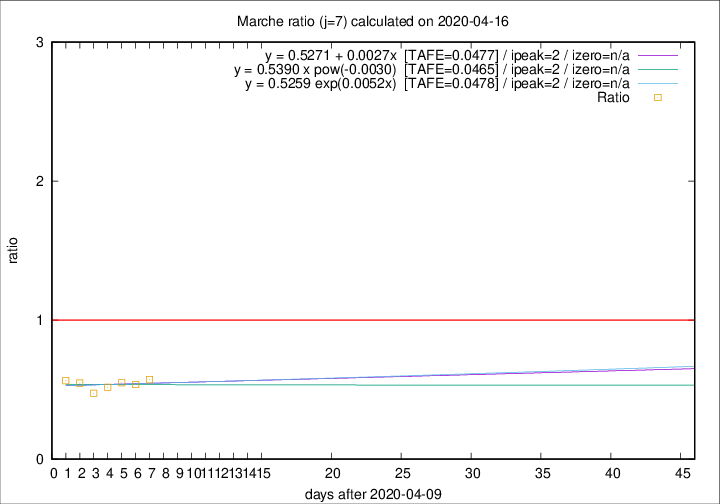
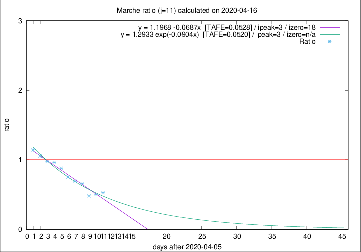

# Marche

Data source: https://raw.githubusercontent.com/pcm-dpc/COVID-19/master/dati-json/dpc-covid19-ita-regioni.json

Estimates in this page were made on 19/4/2020 with data available until 16/04/2020.

## Summary 

### Peak estimate 
|j|linear [TAFE]|exponential [TAFE]|power law [TAFE]|details|
|---|----|-----------|---------|-------|
|7|12/4/2020 [TAFE=0.0477]|12/4/2020 [TAFE=0.0478]|12/4/2020 [TAFE=0.0465]|[analysis](COVID-19_marche_j7_2020-04-16.md)|
|8|11/4/2020 [TAFE=0.1382]|11/4/2020 [TAFE=0.1291]|11/4/2020 [TAFE=0.0981]|[analysis](COVID-19_marche_j8_2020-04-16.md)|
|9|10/4/2020 [TAFE=0.0924]|10/4/2020 [TAFE=0.0848]|10/4/2020 [TAFE=0.0745]|[analysis](COVID-19_marche_j9_2020-04-16.md)|
|10|9/4/2020 [TAFE=0.0758]|9/4/2020 [TAFE=0.0614]|9/4/2020 [TAFE=0.0987]|[analysis](COVID-19_marche_j10_2020-04-16.md)|
|11|9/4/2020 [TAFE=0.0528]|9/4/2020 [TAFE=0.0520]|9/4/2020 [TAFE=0.1073]|[analysis](COVID-19_marche_j11_2020-04-16.md)|
|12|11/4/2020 [TAFE=0.0772]|11/4/2020 [TAFE=0.0496]|9/4/2020 [TAFE=0.0869]|[analysis](COVID-19_marche_j12_2020-04-16.md)|
|13|13/4/2020 [TAFE=0.1498]|12/4/2020 [TAFE=0.0634]|11/4/2020 [TAFE=0.0912]|[analysis](COVID-19_marche_j13_2020-04-16.md)|
|14|14/4/2020 [TAFE=0.1818]|13/4/2020 [TAFE=0.0700]|12/4/2020 [TAFE=0.1058]|[analysis](COVID-19_marche_j14_2020-04-16.md)|

Best estimator is pow with j=7 (TAFE=0.0465)
Corresponding peak date estimate is 12/4/2020 (ipeak 2)

Peak date range estimate: 12/4/2020 - 21/4/2020

### End estimate 
|j|linear [TAFE/TFE]|exponential [TAFE/TFE]|power law [TAFE/TFE]|details|
|---|----|-----------|---------|-------|
|7|-|-|-|[analysis](COVID-19_marche_j7_2020-04-16.md)|
|8|30/4/2020 [TAFE=0.1382]|-|-|[analysis](COVID-19_marche_j8_2020-04-16.md)|
|9|27/4/2020 [TAFE=0.0924]|-|-|[analysis](COVID-19_marche_j9_2020-04-16.md)|
|10|25/4/2020 [TAFE=0.0758]|-|-|[analysis](COVID-19_marche_j10_2020-04-16.md)|
|11|24/4/2020 [TAFE=0.0528]|-|-|[analysis](COVID-19_marche_j11_2020-04-16.md)|
|12|-|-|-|[analysis](COVID-19_marche_j12_2020-04-16.md)|
|13|-|-|-|[analysis](COVID-19_marche_j13_2020-04-16.md)|
|14|-|-|-|[analysis](COVID-19_marche_j14_2020-04-16.md)|

Best estimator is linear with j=11 (TAFE=0.0528)
Corresponding end date estimate is 24/4/2020 (izero 18)

End date range estimate: 6/4/2020 - 27/4/2020

Generated April 19th, 2020 at 18:42:39 UTC+0200 with https://github.com/robianc/COVID-19
