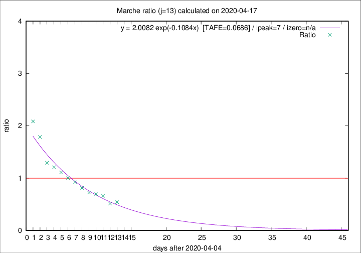

# Marche

Data source: https://raw.githubusercontent.com/pcm-dpc/COVID-19/master/dati-json/dpc-covid19-ita-regioni.json

Delta days analysis (j): 13

Analyses for other values of j for 2020-04-17 are avalable [here](../2020-04-17/README.md)

Analyses for Marche for previous dates are avalable [here](../README.md)

## Fitting 
|fit type|best fit equation|tafe|tfe|ipeak|izero|
|-------|-----|--------|------|---|---|
|exp|y = 2.0082 exp(-0.1084x)  [TAFE=0.0686]|0.0686|0.0029|7|n/a|

## Data
|Date|Daily deaths|Cumulated deaths|Deaths in the last 13 days|Deaths in the 13 days before|ratio|
|----|----------|-----------|-------|--------------------|-----|
|2020-04-17|21|785|211|390|0.5410|
|2020-04-16|18|764|207|403|0.5136|
|2020-04-15|18|746|243|366|0.6639|
|2020-04-14|15|728|251|362|0.6934|
|2020-04-13|13|713|261|360|0.7250|
|2020-04-12|11|700|283|348|0.8132|
|2020-04-11|7|689|303|329|0.9210|
|2020-04-10|13|682|318|318|1.0000|
|2020-04-09|17|669|333|300|1.1100|
|2020-04-08|22|652|342|283|1.2085|
|2020-04-07|18|630|343|265|1.2943|
|2020-04-06|13|612|381|213|1.7887|
|2020-04-05|25|599|396|190|2.0842|

[Download data as CSV](COVID-19_marche_j13_2020-04-17.csv)

Generated April 19th, 2020 at 18:42:39 UTC+0200 with https://github.com/robianc/COVID-19
