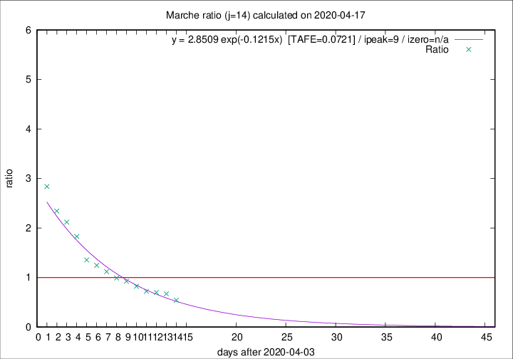

# Marche

Data source: https://raw.githubusercontent.com/pcm-dpc/COVID-19/master/dati-json/dpc-covid19-ita-regioni.json

Delta days analysis (j): 14

Analyses for other values of j for 2020-04-17 are avalable [here](../2020-04-17/README.md)

Analyses for Marche for previous dates are avalable [here](../README.md)

## Fitting 
|fit type|best fit equation|tafe|tfe|ipeak|izero|
|-------|-----|--------|------|---|---|
|exp|y = 2.8509 exp(-0.1215x)  [TAFE=0.0721]|0.0721|0.0031|9|n/a|

## Data
|Date|Daily deaths|Cumulated deaths|Deaths in the last 14 days|Deaths in the 14 days before|ratio|
|----|----------|-----------|-------|--------------------|-----|
|2020-04-17|21|785|228|420|0.5429|
|2020-04-16|18|764|261|388|0.6727|
|2020-04-15|18|746|269|385|0.6987|
|2020-04-14|15|728|276|383|0.7206|
|2020-04-13|13|713|296|360|0.8222|
|2020-04-12|11|700|314|340|0.9235|
|2020-04-11|7|689|325|328|0.9909|
|2020-04-10|13|682|346|309|1.1197|
|2020-04-09|17|669|359|288|1.2465|
|2020-04-08|22|652|365|269|1.3569|
|2020-04-07|18|630|399|218|1.8303|
|2020-04-06|13|612|409|193|2.1192|
|2020-04-05|25|599|415|177|2.3446|
|2020-04-04|17|574|420|148|2.8378|

[Download data as CSV](COVID-19_marche_j14_2020-04-17.csv)

Generated April 19th, 2020 at 18:42:39 UTC+0200 with https://github.com/robianc/COVID-19
