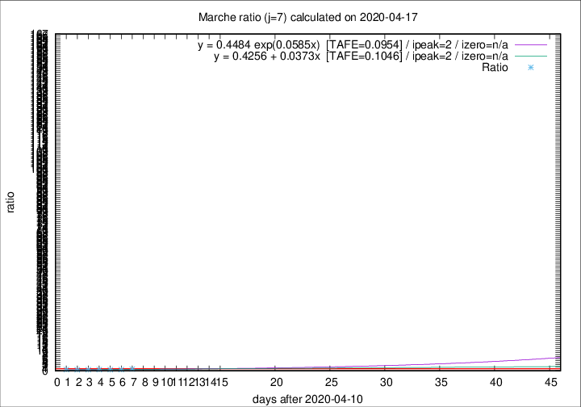

# Marche

Data source: https://raw.githubusercontent.com/pcm-dpc/COVID-19/master/dati-json/dpc-covid19-ita-regioni.json

Delta days analysis (j): 7

Analyses for other values of j for 2020-04-17 are avalable [here](../2020-04-17/README.md)

Analyses for Marche for previous dates are avalable [here](../README.md)

## Fitting 
|fit type|best fit equation|tafe|tfe|ipeak|izero|
|-------|-----|--------|------|---|---|
|linear|y = 0.4256 + 0.0373x  [TAFE=0.1046]|0.1046|0.0128|2|n/a|
|exp|y = 0.4484 exp(0.0585x)  [TAFE=0.0954]|0.0954|0.0062|2|n/a|

## Data
|Date|Daily deaths|Cumulated deaths|Deaths in the last 7 days|Deaths in the 7 days before|ratio|
|----|----------|-----------|-------|--------------------|-----|
|2020-04-17|21|785|103|125|0.8240|
|2020-04-16|18|764|95|166|0.5723|
|2020-04-15|18|746|94|175|0.5371|
|2020-04-14|15|728|98|178|0.5506|
|2020-04-13|13|713|101|195|0.5179|
|2020-04-12|11|700|101|213|0.4742|
|2020-04-11|7|689|115|210|0.5476|

[Download data as CSV](COVID-19_marche_j7_2020-04-17.csv)

Generated April 19th, 2020 at 18:42:39 UTC+0200 with https://github.com/robianc/COVID-19
