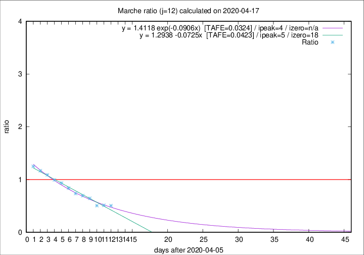

# Marche

Data source: https://raw.githubusercontent.com/pcm-dpc/COVID-19/master/dati-json/dpc-covid19-ita-regioni.json

Estimates in this page were made on 19/4/2020 with data available until 17/04/2020.

## Summary 

### Peak estimate 
|j|linear [TAFE]|exponential [TAFE]|power law [TAFE]|details|
|---|----|-----------|---------|-------|
|7|13/4/2020 [TAFE=0.1046]|13/4/2020 [TAFE=0.0954]|13/4/2020 [TAFE=0.1135]|[analysis](COVID-19_marche_j7_2020-04-17.md)|
|8|12/4/2020 [TAFE=0.1285]|12/4/2020 [TAFE=0.1181]|12/4/2020 [TAFE=0.1135]|[analysis](COVID-19_marche_j8_2020-04-17.md)|
|9|11/4/2020 [TAFE=0.1036]|11/4/2020 [TAFE=0.0990]|11/4/2020 [TAFE=0.0733]|[analysis](COVID-19_marche_j9_2020-04-17.md)|
|10|10/4/2020 [TAFE=0.1127]|10/4/2020 [TAFE=0.0941]|10/4/2020 [TAFE=0.0823]|[analysis](COVID-19_marche_j10_2020-04-17.md)|
|11|9/4/2020 [TAFE=0.0850]|9/4/2020 [TAFE=0.0668]|9/4/2020 [TAFE=0.0994]|[analysis](COVID-19_marche_j11_2020-04-17.md)|
|12|11/4/2020 [TAFE=0.0423]|10/4/2020 [TAFE=0.0324]|9/4/2020 [TAFE=0.1051]|[analysis](COVID-19_marche_j12_2020-04-17.md)|
|13|13/4/2020 [TAFE=0.1377]|12/4/2020 [TAFE=0.0686]|11/4/2020 [TAFE=0.0756]|[analysis](COVID-19_marche_j13_2020-04-17.md)|
|14|14/4/2020 [TAFE=0.1851]|13/4/2020 [TAFE=0.0721]|12/4/2020 [TAFE=0.0927]|[analysis](COVID-19_marche_j14_2020-04-17.md)|

Best estimator is exp with j=12 (TAFE=0.0324)
Corresponding peak date estimate is 10/4/2020 (ipeak 4)

Peak date range estimate: 8/4/2020 - 16/4/2020

### End estimate 
|j|linear [TAFE/TFE]|exponential [TAFE/TFE]|power law [TAFE/TFE]|details|
|---|----|-----------|---------|-------|
|7|-|-|-|[analysis](COVID-19_marche_j7_2020-04-17.md)|
|8|20/5/2020 [TAFE=0.1285]|-|-|[analysis](COVID-19_marche_j8_2020-04-17.md)|
|9|4/5/2020 [TAFE=0.1036]|-|-|[analysis](COVID-19_marche_j9_2020-04-17.md)|
|10|-|-|-|[analysis](COVID-19_marche_j10_2020-04-17.md)|
|11|26/4/2020 [TAFE=0.0850]|-|-|[analysis](COVID-19_marche_j11_2020-04-17.md)|
|12|24/4/2020 [TAFE=0.0423]|-|-|[analysis](COVID-19_marche_j12_2020-04-17.md)|
|13|-|-|-|[analysis](COVID-19_marche_j13_2020-04-17.md)|
|14|-|-|-|[analysis](COVID-19_marche_j14_2020-04-17.md)|

Best estimator is linear with j=12 (TAFE=0.0423)
Corresponding end date estimate is 24/4/2020 (izero 18)

End date range estimate: 6/4/2020 - 16/5/2020

Generated April 19th, 2020 at 18:42:39 UTC+0200 with https://github.com/robianc/COVID-19
