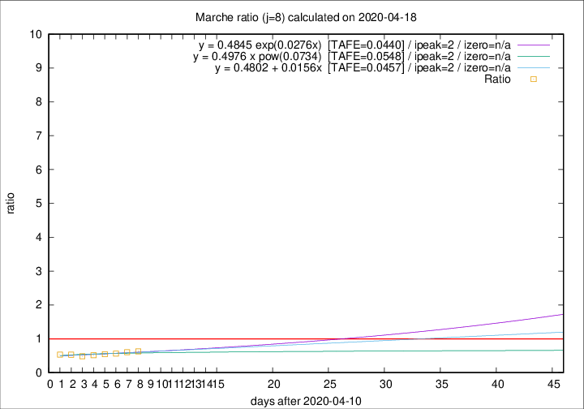
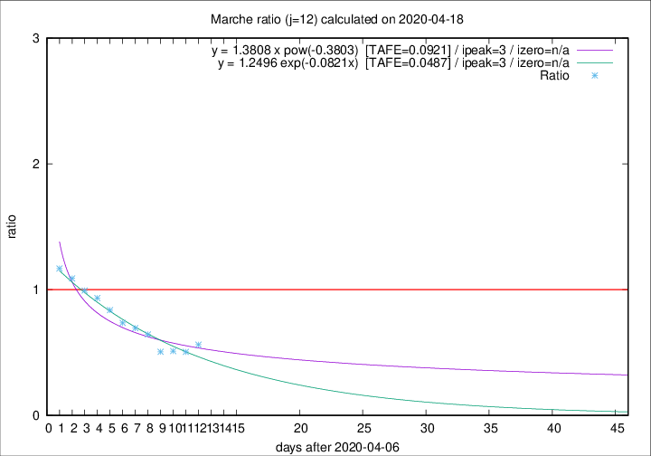

# Marche

Data source: https://raw.githubusercontent.com/pcm-dpc/COVID-19/master/dati-json/dpc-covid19-ita-regioni.json

Estimates in this page were made on 19/4/2020 with data available until 18/04/2020.

## Summary 

### Peak estimate 
|j|linear [TAFE]|exponential [TAFE]|power law [TAFE]|details|
|---|----|-----------|---------|-------|
|7|14/4/2020 [TAFE=0.1057]|14/4/2020 [TAFE=0.0869]|14/4/2020 [TAFE=0.1249]|[analysis](COVID-19_marche_j7_2020-04-18.md)|
|8|13/4/2020 [TAFE=0.0457]|13/4/2020 [TAFE=0.0440]|13/4/2020 [TAFE=0.0548]|[analysis](COVID-19_marche_j8_2020-04-18.md)|
|9|12/4/2020 [TAFE=0.1012]|12/4/2020 [TAFE=0.0977]|12/4/2020 [TAFE=0.0813]|[analysis](COVID-19_marche_j9_2020-04-18.md)|
|10|11/4/2020 [TAFE=0.1104]|11/4/2020 [TAFE=0.1018]|11/4/2020 [TAFE=0.0749]|[analysis](COVID-19_marche_j10_2020-04-18.md)|
|11|10/4/2020 [TAFE=0.1095]|10/4/2020 [TAFE=0.0913]|10/4/2020 [TAFE=0.0935]|[analysis](COVID-19_marche_j11_2020-04-18.md)|
|12|10/4/2020 [TAFE=0.0731]|10/4/2020 [TAFE=0.0487]|10/4/2020 [TAFE=0.0921]|[analysis](COVID-19_marche_j12_2020-04-18.md)|
|13|12/4/2020 [TAFE=0.1023]|12/4/2020 [TAFE=0.0515]|11/4/2020 [TAFE=0.0851]|[analysis](COVID-19_marche_j13_2020-04-18.md)|
|14|14/4/2020 [TAFE=0.1729]|13/4/2020 [TAFE=0.0693]|12/4/2020 [TAFE=0.0907]|[analysis](COVID-19_marche_j14_2020-04-18.md)|

Best estimator is exp with j=8 (TAFE=0.0440)
Corresponding peak date estimate is 13/4/2020 (ipeak 2)

Peak date range estimate: 13/4/2020 - 20/4/2020

### End estimate 
|j|linear [TAFE/TFE]|exponential [TAFE/TFE]|power law [TAFE/TFE]|details|
|---|----|-----------|---------|-------|
|7|-|-|-|[analysis](COVID-19_marche_j7_2020-04-18.md)|
|8|-|-|-|[analysis](COVID-19_marche_j8_2020-04-18.md)|
|9|21/5/2020 [TAFE=0.1012]|-|-|[analysis](COVID-19_marche_j9_2020-04-18.md)|
|10|-|-|-|[analysis](COVID-19_marche_j10_2020-04-18.md)|
|11|-|-|-|[analysis](COVID-19_marche_j11_2020-04-18.md)|
|12|26/4/2020 [TAFE=0.0731]|-|-|[analysis](COVID-19_marche_j12_2020-04-18.md)|
|13|-|-|-|[analysis](COVID-19_marche_j13_2020-04-18.md)|
|14|-|-|-|[analysis](COVID-19_marche_j14_2020-04-18.md)|

Best estimator is linear with j=12 (TAFE=0.0731)
Corresponding end date estimate is 26/4/2020 (izero 19)

End date range estimate: 7/4/2020 - 18/5/2020

Generated April 19th, 2020 at 18:42:39 UTC+0200 with https://github.com/robianc/COVID-19
