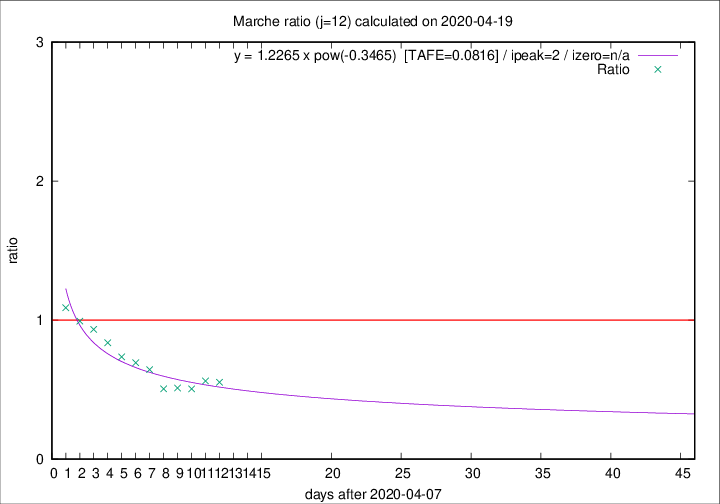

# Marche

Data source: https://raw.githubusercontent.com/pcm-dpc/COVID-19/master/dati-json/dpc-covid19-ita-regioni.json

Delta days analysis (j): 12

Analyses for other values of j for 2020-04-19 are avalable [here](../2020-04-19/README.md)

Analyses for Marche for previous dates are avalable [here](../README.md)

## Fitting 
|fit type|best fit equation|tafe|tfe|ipeak|izero|
|-------|-----|--------|------|---|---|
|pow|y = 1.2265 x pow(-0.3465)  [TAFE=0.0816]|0.0816|0.0041|2|n/a|

## Data
|Date|Daily deaths|Cumulated deaths|Deaths in the last 12 days|Deaths in the 12 days before|ratio|
|----|----------|-----------|-------|--------------------|-----|
|2020-04-19|12|807|177|320|0.5531|
|2020-04-18|10|795|183|325|0.5631|
|2020-04-17|21|785|186|368|0.5054|
|2020-04-16|18|764|190|371|0.5121|
|2020-04-15|18|746|189|373|0.5067|
|2020-04-14|15|728|225|349|0.6447|
|2020-04-13|13|713|236|340|0.6941|
|2020-04-12|11|700|248|337|0.7359|
|2020-04-11|7|689|272|325|0.8369|
|2020-04-10|13|682|296|317|0.9338|
|2020-04-09|17|669|305|307|0.9935|
|2020-04-08|22|652|316|290|1.0897|

[Download data as CSV](COVID-19_marche_j12_2020-04-19.csv)

Generated April 19th, 2020 at 18:42:39 UTC+0200 with https://github.com/robianc/COVID-19
