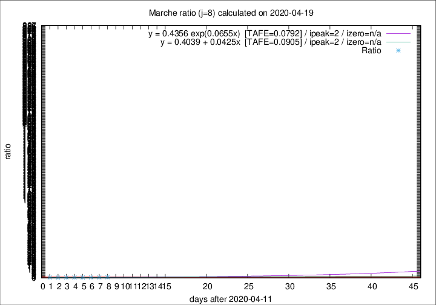

# Marche

Data source: https://raw.githubusercontent.com/pcm-dpc/COVID-19/master/dati-json/dpc-covid19-ita-regioni.json

Delta days analysis (j): 8

Analyses for other values of j for 2020-04-19 are avalable [here](../2020-04-19/README.md)

Analyses for Marche for previous dates are avalable [here](../README.md)

## Fitting 
|fit type|best fit equation|tafe|tfe|ipeak|izero|
|-------|-----|--------|------|---|---|
|linear|y = 0.4039 + 0.0425x  [TAFE=0.0905]|0.0905|0.0093|2|n/a|
|exp|y = 0.4356 exp(0.0655x)  [TAFE=0.0792]|0.0792|0.0045|2|n/a|

## Data
|Date|Daily deaths|Cumulated deaths|Deaths in the last 8 days|Deaths in the 8 days before|ratio|
|----|----------|-----------|-------|--------------------|-----|
|2020-04-19|12|807|118|132|0.8939|
|2020-04-18|10|795|113|179|0.6313|
|2020-04-17|21|785|116|192|0.6042|
|2020-04-16|18|764|112|200|0.5600|
|2020-04-15|18|746|116|213|0.5446|
|2020-04-14|15|728|116|226|0.5133|
|2020-04-13|13|713|114|235|0.4851|
|2020-04-12|11|700|126|238|0.5294|

[Download data as CSV](COVID-19_marche_j8_2020-04-19.csv)

Generated April 19th, 2020 at 18:42:39 UTC+0200 with https://github.com/robianc/COVID-19
