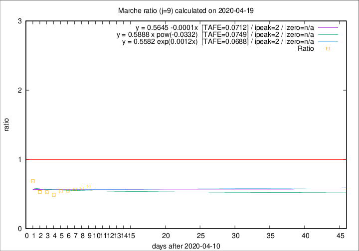

# Marche

Data source: https://raw.githubusercontent.com/pcm-dpc/COVID-19/master/dati-json/dpc-covid19-ita-regioni.json

Delta days analysis (j): 9

Analyses for other values of j for 2020-04-19 are avalable [here](../2020-04-19/README.md)

Analyses for Marche for previous dates are avalable [here](../README.md)

## Fitting 
|fit type|best fit equation|tafe|tfe|ipeak|izero|
|-------|-----|--------|------|---|---|
|linear|y = 0.5645 -0.0001x  [TAFE=0.0712]|0.0712|0.0083|2|n/a|
|exp|y = 0.5582 exp(0.0012x)  [TAFE=0.0688]|0.0688|0.0039|2|n/a|
|pow|y = 0.5888 x pow(-0.0332)  [TAFE=0.0749]|0.0749|0.0039|2|n/a|

## Data
|Date|Daily deaths|Cumulated deaths|Deaths in the last 9 days|Deaths in the 9 days before|ratio|
|----|----------|-----------|-------|--------------------|-----|
|2020-04-19|12|807|125|205|0.6098|
|2020-04-18|10|795|126|217|0.5806|
|2020-04-17|21|785|133|235|0.5660|
|2020-04-16|18|764|134|244|0.5492|
|2020-04-15|18|746|134|248|0.5403|
|2020-04-14|15|728|129|263|0.4905|
|2020-04-13|13|713|139|264|0.5265|
|2020-04-12|11|700|143|270|0.5296|
|2020-04-11|7|689|186|272|0.6838|

[Download data as CSV](COVID-19_marche_j9_2020-04-19.csv)

Generated April 19th, 2020 at 18:42:39 UTC+0200 with https://github.com/robianc/COVID-19
