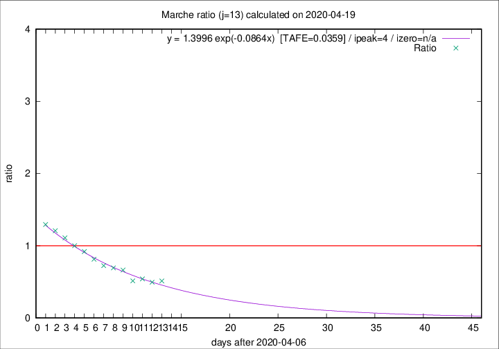

# Marche

Data source: https://raw.githubusercontent.com/pcm-dpc/COVID-19/master/dati-json/dpc-covid19-ita-regioni.json

Estimates in this page were made on 19/4/2020 with data available until 19/04/2020.

## Summary 

### Peak estimate 
|j|linear [TAFE]|exponential [TAFE]|power law [TAFE]|details|
|---|----|-----------|---------|-------|
|7|15/4/2020 [TAFE=0.1030]|15/4/2020 [TAFE=0.0857]|15/4/2020 [TAFE=0.1370]|[analysis](COVID-19_marche_j7_2020-04-19.md)|
|8|14/4/2020 [TAFE=0.0905]|14/4/2020 [TAFE=0.0792]|14/4/2020 [TAFE=0.1040]|[analysis](COVID-19_marche_j8_2020-04-19.md)|
|9|13/4/2020 [TAFE=0.0712]|13/4/2020 [TAFE=0.0688]|13/4/2020 [TAFE=0.0749]|[analysis](COVID-19_marche_j9_2020-04-19.md)|
|10|12/4/2020 [TAFE=0.1003]|12/4/2020 [TAFE=0.0970]|12/4/2020 [TAFE=0.0767]|[analysis](COVID-19_marche_j10_2020-04-19.md)|
|11|11/4/2020 [TAFE=0.1203]|11/4/2020 [TAFE=0.1021]|11/4/2020 [TAFE=0.0766]|[analysis](COVID-19_marche_j11_2020-04-19.md)|
|12|10/4/2020 [TAFE=0.1004]|10/4/2020 [TAFE=0.0795]|10/4/2020 [TAFE=0.0816]|[analysis](COVID-19_marche_j12_2020-04-19.md)|
|13|12/4/2020 [TAFE=0.0708]|11/4/2020 [TAFE=0.0359]|10/4/2020 [TAFE=0.0938]|[analysis](COVID-19_marche_j13_2020-04-19.md)|
|14|14/4/2020 [TAFE=0.1530]|13/4/2020 [TAFE=0.0666]|12/4/2020 [TAFE=0.0790]|[analysis](COVID-19_marche_j14_2020-04-19.md)|

Best estimator is exp with j=13 (TAFE=0.0359)
Corresponding peak date estimate is 11/4/2020 (ipeak 4)

Peak date range estimate: 9/4/2020 - 15/4/2020

### End estimate 
|j|linear [TAFE/TFE]|exponential [TAFE/TFE]|power law [TAFE/TFE]|details|
|---|----|-----------|---------|-------|
|7|-|-|-|[analysis](COVID-19_marche_j7_2020-04-19.md)|
|8|-|-|-|[analysis](COVID-19_marche_j8_2020-04-19.md)|
|9|-|-|-|[analysis](COVID-19_marche_j9_2020-04-19.md)|
|10|14/5/2020 [TAFE=0.1003]|-|-|[analysis](COVID-19_marche_j10_2020-04-19.md)|
|11|-|-|-|[analysis](COVID-19_marche_j11_2020-04-19.md)|
|12|-|-|-|[analysis](COVID-19_marche_j12_2020-04-19.md)|
|13|26/4/2020 [TAFE=0.0708]|-|-|[analysis](COVID-19_marche_j13_2020-04-19.md)|
|14|-|-|-|[analysis](COVID-19_marche_j14_2020-04-19.md)|

Best estimator is linear with j=13 (TAFE=0.0708)
Corresponding end date estimate is 26/4/2020 (izero 19)

End date range estimate: 7/4/2020 - 11/5/2020

Generated April 19th, 2020 at 18:42:39 UTC+0200 with https://github.com/robianc/COVID-19
