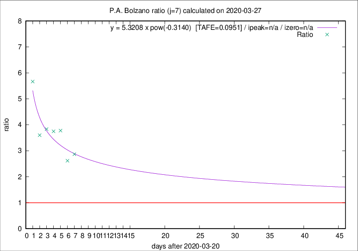

# P.A. Bolzano

Data source: https://raw.githubusercontent.com/pcm-dpc/COVID-19/master/dati-json/dpc-covid19-ita-regioni.json

Estimates in this page were made on 8/4/2020 with data available until 27/03/2020.

## Summary 

### Peak estimate 
|j|linear [TAFE]|exponential [TAFE]|power law [TAFE]|details|
|---|----|-----------|---------|-------|
|7|2/4/2020 [TAFE=0.1149]|8/4/2020 [TAFE=0.1094]|-|[analysis](COVID-19_p.a._bolzano_j7_2020-03-27.md)|
|8|29/3/2020 [TAFE=0.2734]|3/4/2020 [TAFE=0.1409]|7/5/2020 [TAFE=0.0755]|[analysis](COVID-19_p.a._bolzano_j8_2020-03-27.md)|
|9|-|-|-||
|10|-|-|-||
|11|-|-|-||
|12|-|-|-||
|13|-|-|-||
|14|-|-|-||

Best estimator is pow with j=8 (TAFE=0.0755)
Corresponding peak date estimate is 7/5/2020 (ipeak 48)

Peak date range estimate: 20/3/2020 - 7/5/2020

### End estimate 
|j|linear [TAFE/TFE]|exponential [TAFE/TFE]|power law [TAFE/TFE]|details|
|---|----|-----------|---------|-------|
|7|5/4/2020 [TAFE=0.1149]|-|-|[analysis](COVID-19_p.a._bolzano_j7_2020-03-27.md)|
|8|-|-|-|[analysis](COVID-19_p.a._bolzano_j8_2020-03-27.md)|
|9|-|-|-||
|10|-|-|-||
|11|-|-|-||
|12|-|-|-||
|13|-|-|-||
|14|-|-|-||

Best estimator is linear with j=7 (TAFE=0.1149)
Corresponding end date estimate is 5/4/2020 (izero 15)

End date range estimate: 21/3/2020 - 5/4/2020

Generated April 8th, 2020 at 23:43:36 UTC+0200 with https://github.com/robianc/COVID-19
