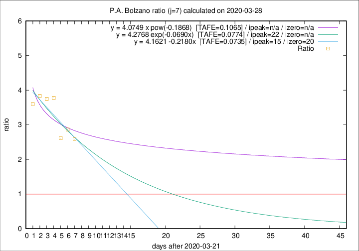

# P.A. Bolzano

Data source: https://raw.githubusercontent.com/pcm-dpc/COVID-19/master/dati-json/dpc-covid19-ita-regioni.json

Estimates in this page were made on 9/4/2020 with data available until 28/03/2020.

## Summary 

### Peak estimate 
|j|linear [TAFE]|exponential [TAFE]|power law [TAFE]|details|
|---|----|-----------|---------|-------|
|7|6/4/2020 [TAFE=0.0735]|13/4/2020 [TAFE=0.0774]|-|[analysis](COVID-19_p.a._bolzano_j7_2020-03-28.md)|
|8|1/4/2020 [TAFE=0.1015]|6/4/2020 [TAFE=0.0721]|19/6/2020 [TAFE=0.0819]|[analysis](COVID-19_p.a._bolzano_j8_2020-03-28.md)|
|9|-|-|-||
|10|-|-|-||
|11|-|-|-||
|12|-|-|-||
|13|-|-|-||
|14|-|-|-||

Best estimator is exp with j=8 (TAFE=0.0721)
Corresponding peak date estimate is 6/4/2020 (ipeak 16)

Peak date range estimate: 21/3/2020 - 19/6/2020

### End estimate 
|j|linear [TAFE/TFE]|exponential [TAFE/TFE]|power law [TAFE/TFE]|details|
|---|----|-----------|---------|-------|
|7|11/4/2020 [TAFE=0.0735]|-|-|[analysis](COVID-19_p.a._bolzano_j7_2020-03-28.md)|
|8|-|-|-|[analysis](COVID-19_p.a._bolzano_j8_2020-03-28.md)|
|9|-|-|-||
|10|-|-|-||
|11|-|-|-||
|12|-|-|-||
|13|-|-|-||
|14|-|-|-||

Best estimator is linear with j=7 (TAFE=0.0735)
Corresponding end date estimate is 11/4/2020 (izero 20)

End date range estimate: 22/3/2020 - 11/4/2020

Generated April 9th, 2020 at 16:40:48 UTC+0200 with https://github.com/robianc/COVID-19
