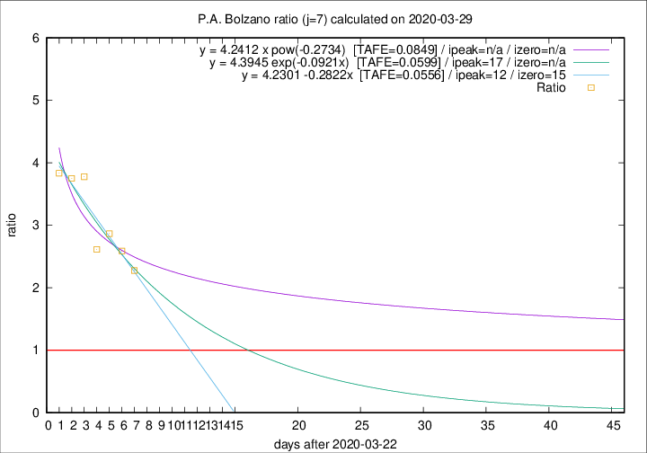

# P.A. Bolzano

Data source: https://raw.githubusercontent.com/pcm-dpc/COVID-19/master/dati-json/dpc-covid19-ita-regioni.json

Delta days analysis (j): 7

Analyses for other values of j for 2020-03-29 are avalable [here](../README.md)

Analyses for P.A. Bolzano for previous dates are avalable [here](../../README.md)

## Fitting 
|fit type|best fit equation|tafe|tfe|ipeak|izero|
|-------|-----|--------|------|---|---|
|linear|y = 4.2301 -0.2822x  [TAFE=0.0556]|0.0556|0.0060|12|15|
|exp|y = 4.3945 exp(-0.0921x)  [TAFE=0.0599]|0.0599|0.0031|17|n/a|
|pow|y = 4.2412 x pow(-0.2734)  [TAFE=0.0849]|0.0849|0.0049|n/a|n/a|

## Data
|Date|Daily deaths|Cumulated deaths|Deaths in the last 7 days|Deaths in the 7 days before|ratio|
|----|----------|-----------|-------|--------------------|-----|
|2020-03-29|0|64|41|18|2.2778|
|2020-03-28|4|64|44|17|2.5882|
|2020-03-27|12|60|43|15|2.8667|
|2020-03-26|5|48|34|13|2.6154|
|2020-03-25|5|43|34|9|3.7778|
|2020-03-24|9|38|30|8|3.7500|
|2020-03-23|6|29|23|6|3.8333|

[Download data as CSV](COVID-19_p.a._bolzano_j7_2020-03-29.csv)

Generated April 10th, 2020 at 17:26:10 UTC+0200 with https://github.com/robianc/COVID-19
