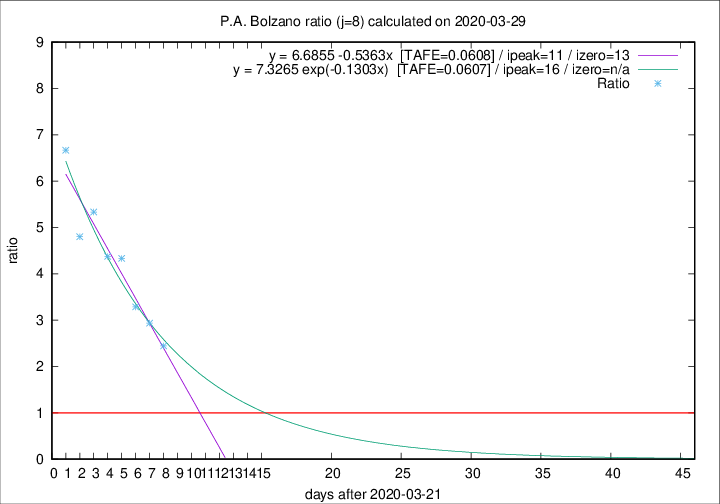

# P.A. Bolzano

Data source: https://raw.githubusercontent.com/pcm-dpc/COVID-19/master/dati-json/dpc-covid19-ita-regioni.json

Delta days analysis (j): 8

## Fitting 
|fit type|best fit equation|tafe|tfe|ipeak|izero|
|-------|-----|--------|------|---|---|
|linear|y = 6.6855 -0.5363x  [TAFE=0.0608]|0.0608|0.0048|11|13|
|exp|y = 7.3265 exp(-0.1303x)  [TAFE=0.0607]|0.0607|0.0031|16|n/a|

## Data
|Date|Daily deaths|Cumulated deaths|Deaths in the last 8 days|Deaths in the 8 days before|ratio|
|----|----------|-----------|-------|--------------------|-----|
|2020-03-29|0|64|44|18|2.4444|
|2020-03-28|4|64|47|16|2.9375|
|2020-03-27|12|60|46|14|3.2857|
|2020-03-26|5|48|39|9|4.3333|
|2020-03-25|5|43|35|8|4.3750|
|2020-03-24|9|38|32|6|5.3333|
|2020-03-23|6|29|24|5|4.8000|
|2020-03-22|3|23|20|3|6.6667|

[Download data as CSV](COVID-19_p.a._bolzano_j8_2020-03-29.csv)

Generated April 8th, 2020 at 23:43:36 UTC+0200 with https://github.com/robianc/COVID-19
