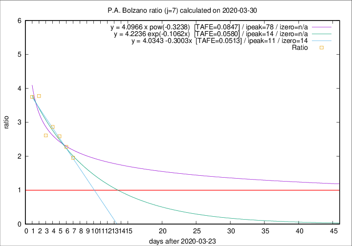

# P.A. Bolzano

Data source: https://raw.githubusercontent.com/pcm-dpc/COVID-19/master/dati-json/dpc-covid19-ita-regioni.json

Delta days analysis (j): 7

Analyses for other values of j for 2020-03-30 are avalable [here](../README.md)

Analyses for P.A. Bolzano for previous dates are avalable [here](../../README.md)

## Fitting 
|fit type|best fit equation|tafe|tfe|ipeak|izero|
|-------|-----|--------|------|---|---|
|linear|y = 4.0343 -0.3003x  [TAFE=0.0513]|0.0513|0.0053|11|14|
|exp|y = 4.2236 exp(-0.1062x)  [TAFE=0.0580]|0.0580|0.0030|14|n/a|
|pow|y = 4.0966 x pow(-0.3238)  [TAFE=0.0847]|0.0847|0.0043|78|n/a|

## Data
|Date|Daily deaths|Cumulated deaths|Deaths in the last 7 days|Deaths in the 7 days before|ratio|
|----|----------|-----------|-------|--------------------|-----|
|2020-03-30|10|74|45|23|1.9565|
|2020-03-29|0|64|41|18|2.2778|
|2020-03-28|4|64|44|17|2.5882|
|2020-03-27|12|60|43|15|2.8667|
|2020-03-26|5|48|34|13|2.6154|
|2020-03-25|5|43|34|9|3.7778|
|2020-03-24|9|38|30|8|3.7500|

[Download data as CSV](COVID-19_p.a._bolzano_j7_2020-03-30.csv)

Generated April 12th, 2020 at 16:28:18 UTC+0200 with https://github.com/robianc/COVID-19
