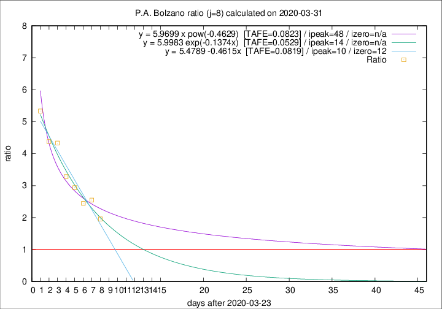

# P.A. Bolzano

Data source: https://raw.githubusercontent.com/pcm-dpc/COVID-19/master/dati-json/dpc-covid19-ita-regioni.json

Delta days analysis (j): 8

Analyses for other values of j for 2020-03-31 are avalable [here](../2020-03-31/README.md)

Analyses for P.A. Bolzano for previous dates are avalable [here](../README.md)

## Fitting 
|fit type|best fit equation|tafe|tfe|ipeak|izero|
|-------|-----|--------|------|---|---|
|linear|y = 5.4789 -0.4615x  [TAFE=0.0819]|0.0819|0.0019|10|12|
|exp|y = 5.9983 exp(-0.1374x)  [TAFE=0.0529]|0.0529|0.0019|14|n/a|
|pow|y = 5.9699 x pow(-0.4629)  [TAFE=0.0823]|0.0823|0.0050|48|n/a|

## Data
|Date|Daily deaths|Cumulated deaths|Deaths in the last 8 days|Deaths in the 8 days before|ratio|
|----|----------|-----------|-------|--------------------|-----|
|2020-03-31|2|76|47|24|1.9583|
|2020-03-30|10|74|51|20|2.5500|
|2020-03-29|0|64|44|18|2.4444|
|2020-03-28|4|64|47|16|2.9375|
|2020-03-27|12|60|46|14|3.2857|
|2020-03-26|5|48|39|9|4.3333|
|2020-03-25|5|43|35|8|4.3750|
|2020-03-24|9|38|32|6|5.3333|

[Download data as CSV](COVID-19_p.a._bolzano_j8_2020-03-31.csv)

Generated April 19th, 2020 at 18:42:39 UTC+0200 with https://github.com/robianc/COVID-19
