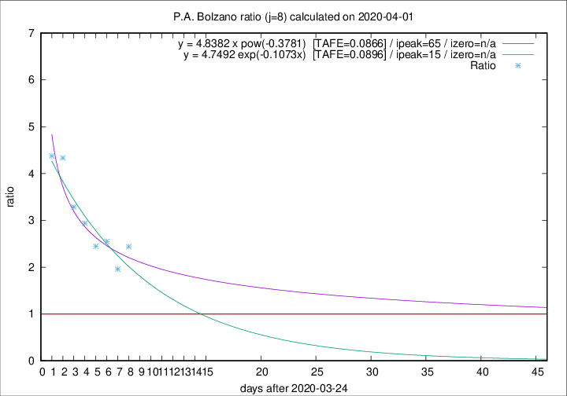

# P.A. Bolzano

Data source: https://raw.githubusercontent.com/pcm-dpc/COVID-19/master/dati-json/dpc-covid19-ita-regioni.json

Estimates in this page were made on 12/4/2020 with data available until 01/04/2020.

## Summary 

### Peak estimate 
|j|linear [TAFE]|exponential [TAFE]|power law [TAFE]|details|
|---|----|-----------|---------|-------|
|7|6/4/2020 [TAFE=0.1398]|8/4/2020 [TAFE=0.1406]|30/5/2020 [TAFE=0.1625]|[analysis](COVID-19_p.a._bolzano_j7_2020-04-01.md)|
|8|5/4/2020 [TAFE=0.1064]|9/4/2020 [TAFE=0.0896]|29/5/2020 [TAFE=0.0866]|[analysis](COVID-19_p.a._bolzano_j8_2020-04-01.md)|
|9|5/4/2020 [TAFE=0.1581]|10/4/2020 [TAFE=0.1325]|20/6/2020 [TAFE=0.1461]|[analysis](COVID-19_p.a._bolzano_j9_2020-04-01.md)|
|10|3/4/2020 [TAFE=0.1952]|9/4/2020 [TAFE=0.1551]|26/5/2020 [TAFE=0.1717]|[analysis](COVID-19_p.a._bolzano_j10_2020-04-01.md)|
|11|-|-|-||
|12|-|-|-||
|13|-|-|-||
|14|-|-|-||

Best estimator is pow with j=8 (TAFE=0.0866)
Corresponding peak date estimate is 29/5/2020 (ipeak 65)

Peak date range estimate: 25/3/2020 - 21/6/2020

### End estimate 
|j|linear [TAFE/TFE]|exponential [TAFE/TFE]|power law [TAFE/TFE]|details|
|---|----|-----------|---------|-------|
|7|12/4/2020 [TAFE=0.1398]|-|-|[analysis](COVID-19_p.a._bolzano_j7_2020-04-01.md)|
|8|8/4/2020 [TAFE=0.1064]|-|-|[analysis](COVID-19_p.a._bolzano_j8_2020-04-01.md)|
|9|-|-|-|[analysis](COVID-19_p.a._bolzano_j9_2020-04-01.md)|
|10|-|-|-|[analysis](COVID-19_p.a._bolzano_j10_2020-04-01.md)|
|11|-|-|-||
|12|-|-|-||
|13|-|-|-||
|14|-|-|-||

Best estimator is linear with j=8 (TAFE=0.1064)
Corresponding end date estimate is 8/4/2020 (izero 14)

End date range estimate: 25/3/2020 - 11/4/2020

Generated April 12th, 2020 at 17:02:01 UTC+0200 with https://github.com/robianc/COVID-19
