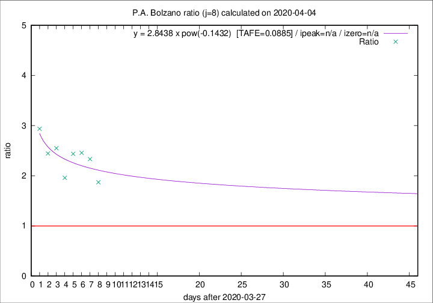

# P.A. Bolzano

Data source: https://raw.githubusercontent.com/pcm-dpc/COVID-19/master/dati-json/dpc-covid19-ita-regioni.json

Estimates in this page were made on 8/4/2020 with data available until 04/04/2020.

## Summary 

### Peak estimate 
|j|linear [TAFE]|exponential [TAFE]|power law [TAFE]|details|
|---|----|-----------|---------|-------|
|7|15/6/2020 [TAFE=0.1500]|-|-|[analysis](COVID-19_p.a._bolzano_j7_2020-04-04.md)|
|8|17/4/2020 [TAFE=0.0889]|24/4/2020 [TAFE=0.0904]|-|[analysis](COVID-19_p.a._bolzano_j8_2020-04-04.md)|
|9|10/4/2020 [TAFE=0.1684]|18/4/2020 [TAFE=0.1394]|-|[analysis](COVID-19_p.a._bolzano_j9_2020-04-04.md)|
|10|8/4/2020 [TAFE=0.2019]|15/4/2020 [TAFE=0.1709]|-|[analysis](COVID-19_p.a._bolzano_j10_2020-04-04.md)|
|11|7/4/2020 [TAFE=0.2220]|14/4/2020 [TAFE=0.1446]|30/6/2020 [TAFE=0.1350]|[analysis](COVID-19_p.a._bolzano_j11_2020-04-04.md)|
|12|5/4/2020 [TAFE=0.4763]|12/4/2020 [TAFE=0.2012]|25/5/2020 [TAFE=0.0806]|[analysis](COVID-19_p.a._bolzano_j12_2020-04-04.md)|
|13|-|-|-||
|14|-|-|-||

Best estimator is pow with j=12 (TAFE=0.0806)
Corresponding peak date estimate is 25/5/2020 (ipeak 62)

Peak date range estimate: 24/3/2020 - 29/6/2020

### End estimate 
|j|linear [TAFE/TFE]|exponential [TAFE/TFE]|power law [TAFE/TFE]|details|
|---|----|-----------|---------|-------|
|7|-|-|-|[analysis](COVID-19_p.a._bolzano_j7_2020-04-04.md)|
|8|27/4/2020 [TAFE=0.0889]|-|-|[analysis](COVID-19_p.a._bolzano_j8_2020-04-04.md)|
|9|-|-|-|[analysis](COVID-19_p.a._bolzano_j9_2020-04-04.md)|
|10|-|-|-|[analysis](COVID-19_p.a._bolzano_j10_2020-04-04.md)|
|11|-|-|-|[analysis](COVID-19_p.a._bolzano_j11_2020-04-04.md)|
|12|-|-|-|[analysis](COVID-19_p.a._bolzano_j12_2020-04-04.md)|
|13|-|-|-||
|14|-|-|-||

Best estimator is linear with j=8 (TAFE=0.0889)
Corresponding end date estimate is 27/4/2020 (izero 30)

End date range estimate: 28/3/2020 - 27/4/2020

Generated April 8th, 2020 at 23:43:36 UTC+0200 with https://github.com/robianc/COVID-19
