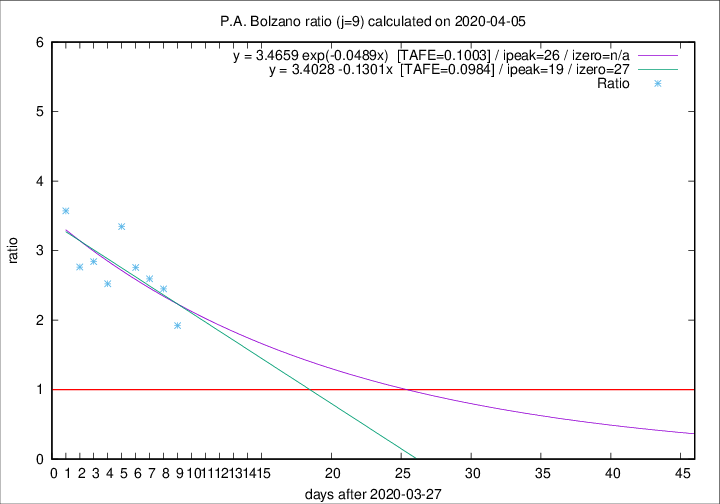

# P.A. Bolzano

Data source: https://raw.githubusercontent.com/pcm-dpc/COVID-19/master/dati-json/dpc-covid19-ita-regioni.json

Delta days analysis (j): 9

Analyses for other values of j for 2020-04-05 are avalable [here](../2020-04-05/README.md)

Analyses for P.A. Bolzano for previous dates are avalable [here](../README.md)

## Fitting 
|fit type|best fit equation|tafe|tfe|ipeak|izero|
|-------|-----|--------|------|---|---|
|linear|y = 3.4028 -0.1301x  [TAFE=0.0984]|0.0984|0.0127|19|27|
|exp|y = 3.4659 exp(-0.0489x)  [TAFE=0.1003]|0.1003|0.0065|26|n/a|

## Data
|Date|Daily deaths|Cumulated deaths|Deaths in the last 9 days|Deaths in the 9 days before|ratio|
|----|----------|-----------|-------|--------------------|-----|
|2020-04-05|12|158|98|51|1.9216|
|2020-04-04|7|146|98|40|2.4500|
|2020-04-03|10|139|96|37|2.5946|
|2020-04-02|13|129|91|33|2.7576|
|2020-04-01|40|116|87|26|3.3462|
|2020-03-31|2|76|53|21|2.5238|
|2020-03-30|10|74|54|19|2.8421|
|2020-03-29|0|64|47|17|2.7647|
|2020-03-28|4|64|50|14|3.5714|

[Download data as CSV](COVID-19_p.a._bolzano_j9_2020-04-05.csv)

Generated April 16th, 2020 at 20:09:19 UTC+0200 with https://github.com/robianc/COVID-19
