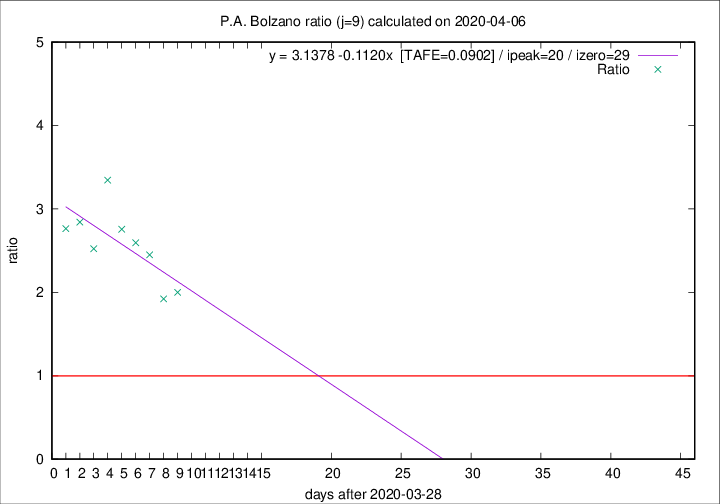

# P.A. Bolzano

Data source: https://raw.githubusercontent.com/pcm-dpc/COVID-19/master/dati-json/dpc-covid19-ita-regioni.json

Estimates in this page were made on 14/4/2020 with data available until 06/04/2020.

## Summary 

### Peak estimate 
|j|linear [TAFE]|exponential [TAFE]|power law [TAFE]|details|
|---|----|-----------|---------|-------|
|7|-|-|-|[analysis](COVID-19_p.a._bolzano_j7_2020-04-06.md)|
|8|3/5/2020 [TAFE=0.0948]|17/5/2020 [TAFE=0.0958]|-|[analysis](COVID-19_p.a._bolzano_j8_2020-04-06.md)|
|9|18/4/2020 [TAFE=0.0902]|24/4/2020 [TAFE=0.0944]|-|[analysis](COVID-19_p.a._bolzano_j9_2020-04-06.md)|
|10|11/4/2020 [TAFE=0.1521]|18/4/2020 [TAFE=0.1513]|-|[analysis](COVID-19_p.a._bolzano_j10_2020-04-06.md)|
|11|10/4/2020 [TAFE=0.1468]|17/4/2020 [TAFE=0.1212]|-|[analysis](COVID-19_p.a._bolzano_j11_2020-04-06.md)|
|12|8/4/2020 [TAFE=0.1777]|16/4/2020 [TAFE=0.1021]|29/6/2020 [TAFE=0.1237]|[analysis](COVID-19_p.a._bolzano_j12_2020-04-06.md)|
|13|6/4/2020 [TAFE=0.4877]|14/4/2020 [TAFE=0.1638]|28/5/2020 [TAFE=0.0811]|[analysis](COVID-19_p.a._bolzano_j13_2020-04-06.md)|
|14|-|-|-||

Best estimator is pow with j=13 (TAFE=0.0811)
Corresponding peak date estimate is 28/5/2020 (ipeak 64)

Peak date range estimate: 25/3/2020 - 28/6/2020

### End estimate 
|j|linear [TAFE/TFE]|exponential [TAFE/TFE]|power law [TAFE/TFE]|details|
|---|----|-----------|---------|-------|
|7|-|-|-|[analysis](COVID-19_p.a._bolzano_j7_2020-04-06.md)|
|8|27/5/2020 [TAFE=0.0948]|-|-|[analysis](COVID-19_p.a._bolzano_j8_2020-04-06.md)|
|9|27/4/2020 [TAFE=0.0902]|-|-|[analysis](COVID-19_p.a._bolzano_j9_2020-04-06.md)|
|10|-|-|-|[analysis](COVID-19_p.a._bolzano_j10_2020-04-06.md)|
|11|-|-|-|[analysis](COVID-19_p.a._bolzano_j11_2020-04-06.md)|
|12|-|-|-|[analysis](COVID-19_p.a._bolzano_j12_2020-04-06.md)|
|13|-|-|-|[analysis](COVID-19_p.a._bolzano_j13_2020-04-06.md)|
|14|-|-|-||

Best estimator is linear with j=9 (TAFE=0.0902)
Corresponding end date estimate is 27/4/2020 (izero 29)

End date range estimate: 29/3/2020 - 26/5/2020

Generated April 14th, 2020 at 19:16:04 UTC+0200 with https://github.com/robianc/COVID-19
