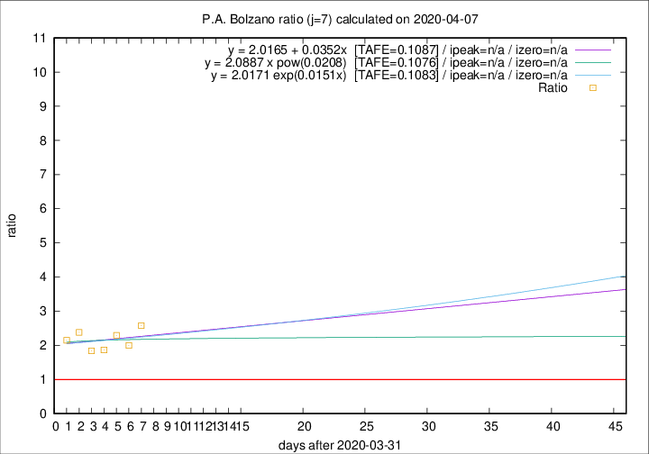

# P.A. Bolzano

Data source: https://raw.githubusercontent.com/pcm-dpc/COVID-19/master/dati-json/dpc-covid19-ita-regioni.json

Delta days analysis (j): 7

## Fitting 
|fit type|best fit equation|tafe|tfe|ipeak|izero|
|-------|-----|--------|------|---|---|
|linear|y = 2.0165 + 0.0352x  [TAFE=0.1087]|0.1087|0.0131|n/a|n/a|
|exp|y = 2.0171 exp(0.0151x)  [TAFE=0.1083]|0.1083|0.0068|n/a|n/a|
|pow|y = 2.0887 x pow(0.0208)  [TAFE=0.1076]|0.1076|0.0069|n/a|n/a|

## Data
|Date|Daily deaths|Cumulated deaths|Deaths in the last 7 days|Deaths in the 7 days before|ratio|
|----|----------|-----------|-------|--------------------|-----|
|2020-04-07|10|174|98|38|2.5789|
|2020-04-06|6|164|90|45|2.0000|
|2020-04-05|12|158|94|41|2.2927|
|2020-04-04|7|146|82|44|1.8636|
|2020-04-03|10|139|79|43|1.8372|
|2020-04-02|13|129|81|34|2.3824|
|2020-04-01|40|116|73|34|2.1471|

[Download data as CSV](COVID-19_p.a._bolzano_j7_2020-04-07.csv)

Generated April 9th, 2020 at 16:40:48 UTC+0200 with https://github.com/robianc/COVID-19
