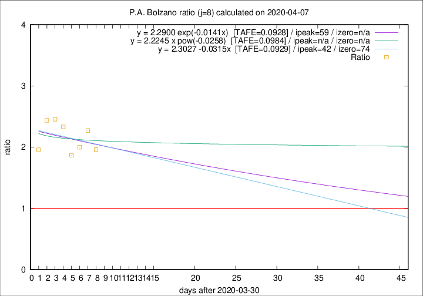

# P.A. Bolzano

Data source: https://raw.githubusercontent.com/pcm-dpc/COVID-19/master/dati-json/dpc-covid19-ita-regioni.json

Delta days analysis (j): 8

Analyses for other values of j for 2020-04-07 are avalable [here](../2020-04-07/README.md)

Analyses for P.A. Bolzano for previous dates are avalable [here](../README.md)

## Fitting 
|fit type|best fit equation|tafe|tfe|ipeak|izero|
|-------|-----|--------|------|---|---|
|linear|y = 2.3027 -0.0315x  [TAFE=0.0929]|0.0929|0.0096|42|74|
|exp|y = 2.2900 exp(-0.0141x)  [TAFE=0.0928]|0.0928|0.0046|59|n/a|
|pow|y = 2.2245 x pow(-0.0258)  [TAFE=0.0984]|0.0984|0.0052|n/a|n/a|

## Data
|Date|Daily deaths|Cumulated deaths|Deaths in the last 8 days|Deaths in the 8 days before|ratio|
|----|----------|-----------|-------|--------------------|-----|
|2020-04-07|10|174|100|51|1.9608|
|2020-04-06|6|164|100|44|2.2727|
|2020-04-05|12|158|94|47|2.0000|
|2020-04-04|7|146|86|46|1.8696|
|2020-04-03|10|139|91|39|2.3333|
|2020-04-02|13|129|86|35|2.4571|
|2020-04-01|40|116|78|32|2.4375|
|2020-03-31|2|76|47|24|1.9583|

[Download data as CSV](COVID-19_p.a._bolzano_j8_2020-04-07.csv)

Generated April 12th, 2020 at 17:02:01 UTC+0200 with https://github.com/robianc/COVID-19
