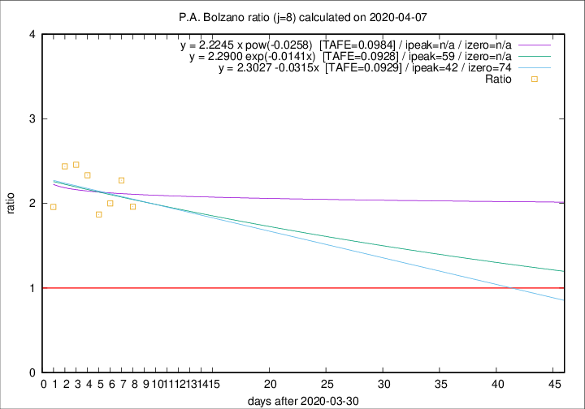

# P.A. Bolzano

Data source: https://raw.githubusercontent.com/pcm-dpc/COVID-19/master/dati-json/dpc-covid19-ita-regioni.json

Estimates in this page were made on 9/4/2020 with data available until 07/04/2020.

## Summary 

### Peak estimate 
|j|linear [TAFE]|exponential [TAFE]|power law [TAFE]|details|
|---|----|-----------|---------|-------|
|7|-|-|-|[analysis](COVID-19_p.a._bolzano_j7_2020-04-07.md)|
|8|12/5/2020 [TAFE=0.0929]|29/5/2020 [TAFE=0.0928]|-|[analysis](COVID-19_p.a._bolzano_j8_2020-04-07.md)|
|9|18/4/2020 [TAFE=0.0942]|25/4/2020 [TAFE=0.0968]|-|[analysis](COVID-19_p.a._bolzano_j9_2020-04-07.md)|
|10|15/4/2020 [TAFE=0.1072]|20/4/2020 [TAFE=0.1183]|-|[analysis](COVID-19_p.a._bolzano_j10_2020-04-07.md)|
|11|11/4/2020 [TAFE=0.1161]|17/4/2020 [TAFE=0.1204]|-|[analysis](COVID-19_p.a._bolzano_j11_2020-04-07.md)|
|12|10/4/2020 [TAFE=0.1209]|17/4/2020 [TAFE=0.0985]|-|[analysis](COVID-19_p.a._bolzano_j12_2020-04-07.md)|
|13|8/4/2020 [TAFE=0.2759]|16/4/2020 [TAFE=0.1161]|14/6/2020 [TAFE=0.1113]|[analysis](COVID-19_p.a._bolzano_j13_2020-04-07.md)|
|14|-|-|-||

Best estimator is exp with j=8 (TAFE=0.0928)
Corresponding peak date estimate is 29/5/2020 (ipeak 59)

Peak date range estimate: 31/3/2020 - 19/6/2020

### End estimate 
|j|linear [TAFE/TFE]|exponential [TAFE/TFE]|power law [TAFE/TFE]|details|
|---|----|-----------|---------|-------|
|7|-|-|-|[analysis](COVID-19_p.a._bolzano_j7_2020-04-07.md)|
|8|13/6/2020 [TAFE=0.0929]|-|-|[analysis](COVID-19_p.a._bolzano_j8_2020-04-07.md)|
|9|-|-|-|[analysis](COVID-19_p.a._bolzano_j9_2020-04-07.md)|
|10|-|-|-|[analysis](COVID-19_p.a._bolzano_j10_2020-04-07.md)|
|11|-|-|-|[analysis](COVID-19_p.a._bolzano_j11_2020-04-07.md)|
|12|-|-|-|[analysis](COVID-19_p.a._bolzano_j12_2020-04-07.md)|
|13|-|-|-|[analysis](COVID-19_p.a._bolzano_j13_2020-04-07.md)|
|14|-|-|-||

Best estimator is linear with j=8 (TAFE=0.0929)
Corresponding end date estimate is 13/6/2020 (izero 74)

End date range estimate: 31/3/2020 - 13/6/2020

Generated April 9th, 2020 at 16:40:48 UTC+0200 with https://github.com/robianc/COVID-19
