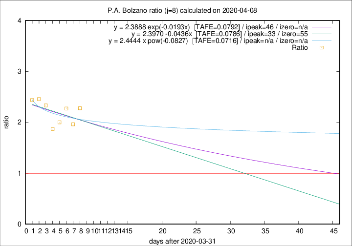

# P.A. Bolzano

Data source: https://raw.githubusercontent.com/pcm-dpc/COVID-19/master/dati-json/dpc-covid19-ita-regioni.json

Delta days analysis (j): 8

Analyses for other values of j for 2020-04-08 are avalable [here](../README.md)

Analyses for P.A. Bolzano for previous dates are avalable [here](../../README.md)

## Fitting 
|fit type|best fit equation|tafe|tfe|ipeak|izero|
|-------|-----|--------|------|---|---|
|linear|y = 2.3970 -0.0436x  [TAFE=0.0786]|0.0786|0.0076|33|55|
|exp|y = 2.3888 exp(-0.0193x)  [TAFE=0.0792]|0.0792|0.0037|46|n/a|
|pow|y = 2.4444 x pow(-0.0827)  [TAFE=0.0716]|0.0716|0.0034|n/a|n/a|

## Data
|Date|Daily deaths|Cumulated deaths|Deaths in the last 8 days|Deaths in the 8 days before|ratio|
|----|----------|-----------|-------|--------------------|-----|
|2020-04-08|9|183|107|47|2.2766|
|2020-04-07|10|174|100|51|1.9608|
|2020-04-06|6|164|100|44|2.2727|
|2020-04-05|12|158|94|47|2.0000|
|2020-04-04|7|146|86|46|1.8696|
|2020-04-03|10|139|91|39|2.3333|
|2020-04-02|13|129|86|35|2.4571|
|2020-04-01|40|116|78|32|2.4375|

[Download data as CSV](COVID-19_p.a._bolzano_j8_2020-04-08.csv)

Generated April 12th, 2020 at 16:28:18 UTC+0200 with https://github.com/robianc/COVID-19
