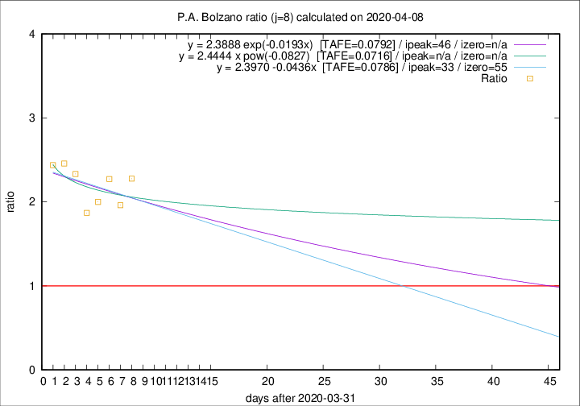

# P.A. Bolzano

Data source: https://raw.githubusercontent.com/pcm-dpc/COVID-19/master/dati-json/dpc-covid19-ita-regioni.json

Estimates in this page were made on 9/4/2020 with data available until 08/04/2020.

## Summary 

### Peak estimate 
|j|linear [TAFE]|exponential [TAFE]|power law [TAFE]|details|
|---|----|-----------|---------|-------|
|7|16/4/2020 [TAFE=0.2406]|15/4/2020 [TAFE=0.2298]|27/6/2020 [TAFE=0.2367]|[analysis](COVID-19_p.a._bolzano_j7_2020-04-08.md)|
|8|4/5/2020 [TAFE=0.0786]|17/5/2020 [TAFE=0.0792]|-|[analysis](COVID-19_p.a._bolzano_j8_2020-04-08.md)|
|9|17/4/2020 [TAFE=0.0905]|24/4/2020 [TAFE=0.0916]|-|[analysis](COVID-19_p.a._bolzano_j9_2020-04-08.md)|
|10|16/4/2020 [TAFE=0.1230]|21/4/2020 [TAFE=0.1206]|-|[analysis](COVID-19_p.a._bolzano_j10_2020-04-08.md)|
|11|12/4/2020 [TAFE=0.1148]|18/4/2020 [TAFE=0.1131]|-|[analysis](COVID-19_p.a._bolzano_j11_2020-04-08.md)|
|12|11/4/2020 [TAFE=0.1044]|17/4/2020 [TAFE=0.0998]|29/6/2020 [TAFE=0.1580]|[analysis](COVID-19_p.a._bolzano_j12_2020-04-08.md)|
|13|10/4/2020 [TAFE=0.1675]|17/4/2020 [TAFE=0.0893]|20/6/2020 [TAFE=0.1243]|[analysis](COVID-19_p.a._bolzano_j13_2020-04-08.md)|
|14|8/4/2020 [TAFE=0.5341]|16/4/2020 [TAFE=0.1619]|27/5/2020 [TAFE=0.1357]|[analysis](COVID-19_p.a._bolzano_j14_2020-04-08.md)|

Best estimator is linear with j=8 (TAFE=0.0786)
Corresponding peak date estimate is 4/5/2020 (ipeak 33)

Peak date range estimate: 1/4/2020 - 3/7/2020

### End estimate 
|j|linear [TAFE/TFE]|exponential [TAFE/TFE]|power law [TAFE/TFE]|details|
|---|----|-----------|---------|-------|
|7|26/4/2020 [TAFE=0.2406]|-|-|[analysis](COVID-19_p.a._bolzano_j7_2020-04-08.md)|
|8|26/5/2020 [TAFE=0.0786]|-|-|[analysis](COVID-19_p.a._bolzano_j8_2020-04-08.md)|
|9|-|-|-|[analysis](COVID-19_p.a._bolzano_j9_2020-04-08.md)|
|10|-|-|-|[analysis](COVID-19_p.a._bolzano_j10_2020-04-08.md)|
|11|-|-|-|[analysis](COVID-19_p.a._bolzano_j11_2020-04-08.md)|
|12|-|-|-|[analysis](COVID-19_p.a._bolzano_j12_2020-04-08.md)|
|13|-|-|-|[analysis](COVID-19_p.a._bolzano_j13_2020-04-08.md)|
|14|-|-|-|[analysis](COVID-19_p.a._bolzano_j14_2020-04-08.md)|

Best estimator is linear with j=8 (TAFE=0.0786)
Corresponding end date estimate is 26/5/2020 (izero 55)

End date range estimate: 1/4/2020 - 26/5/2020

Generated April 9th, 2020 at 16:40:48 UTC+0200 with https://github.com/robianc/COVID-19
