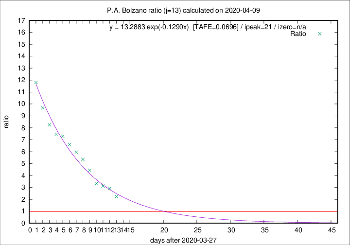

# P.A. Bolzano

Data source: https://raw.githubusercontent.com/pcm-dpc/COVID-19/master/dati-json/dpc-covid19-ita-regioni.json

Delta days analysis (j): 13

Analyses for other values of j for 2020-04-09 are avalable [here](../2020-04-09/README.md)

Analyses for P.A. Bolzano for previous dates are avalable [here](../README.md)

## Fitting 
|fit type|best fit equation|tafe|tfe|ipeak|izero|
|-------|-----|--------|------|---|---|
|exp|y = 13.2883 exp(-0.1290x)  [TAFE=0.0696]|0.0696|0.0028|21|n/a|

## Data
|Date|Daily deaths|Cumulated deaths|Deaths in the last 13 days|Deaths in the 13 days before|ratio|
|----|----------|-----------|-------|--------------------|-----|
|2020-04-09|4|187|127|57|2.2281|
|2020-04-08|9|183|135|46|2.9348|
|2020-04-07|10|174|131|42|3.1190|
|2020-04-06|6|164|126|38|3.3158|
|2020-04-05|12|158|129|29|4.4483|
|2020-04-04|7|146|123|23|5.3478|
|2020-04-03|10|139|119|20|5.9500|
|2020-04-02|13|129|112|17|6.5882|
|2020-04-01|40|116|102|14|7.2857|
|2020-03-31|2|76|67|9|7.4444|
|2020-03-30|10|74|66|8|8.2500|
|2020-03-29|0|64|58|6|9.6667|
|2020-03-28|4|64|59|5|11.8000|

[Download data as CSV](COVID-19_p.a._bolzano_j13_2020-04-09.csv)

Generated April 14th, 2020 at 19:16:04 UTC+0200 with https://github.com/robianc/COVID-19
