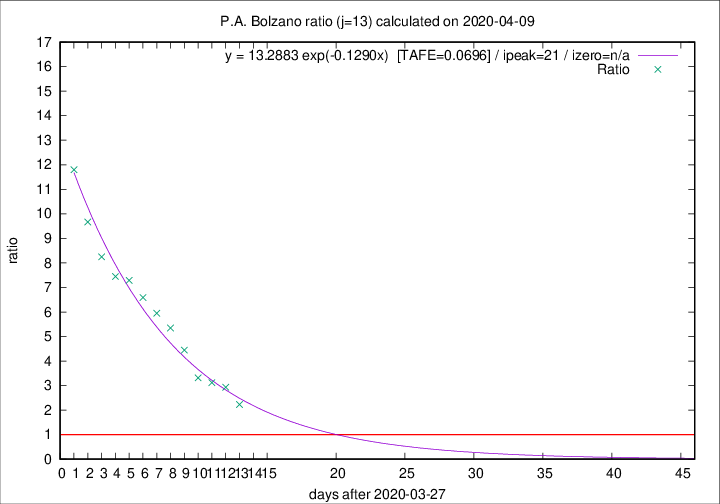

# P.A. Bolzano

Data source: https://raw.githubusercontent.com/pcm-dpc/COVID-19/master/dati-json/dpc-covid19-ita-regioni.json

Estimates in this page were made on 14/4/2020 with data available until 09/04/2020.

## Summary 

### Peak estimate 
|j|linear [TAFE]|exponential [TAFE]|power law [TAFE]|details|
|---|----|-----------|---------|-------|
|7|12/4/2020 [TAFE=0.3218]|11/4/2020 [TAFE=0.2993]|17/4/2020 [TAFE=0.3564]|[analysis](COVID-19_p.a._bolzano_j7_2020-04-09.md)|
|8|15/4/2020 [TAFE=0.1766]|15/4/2020 [TAFE=0.1820]|30/5/2020 [TAFE=0.2028]|[analysis](COVID-19_p.a._bolzano_j8_2020-04-09.md)|
|9|17/4/2020 [TAFE=0.0889]|22/4/2020 [TAFE=0.0770]|-|[analysis](COVID-19_p.a._bolzano_j9_2020-04-09.md)|
|10|15/4/2020 [TAFE=0.1246]|20/4/2020 [TAFE=0.1149]|-|[analysis](COVID-19_p.a._bolzano_j10_2020-04-09.md)|
|11|14/4/2020 [TAFE=0.1154]|19/4/2020 [TAFE=0.1110]|-|[analysis](COVID-19_p.a._bolzano_j11_2020-04-09.md)|
|12|12/4/2020 [TAFE=0.0926]|17/4/2020 [TAFE=0.0945]|29/6/2020 [TAFE=0.1735]|[analysis](COVID-19_p.a._bolzano_j12_2020-04-09.md)|
|13|11/4/2020 [TAFE=0.0761]|18/4/2020 [TAFE=0.0696]|27/6/2020 [TAFE=0.1782]|[analysis](COVID-19_p.a._bolzano_j13_2020-04-09.md)|
|14|10/4/2020 [TAFE=0.3013]|17/4/2020 [TAFE=0.1222]|7/6/2020 [TAFE=0.1584]|[analysis](COVID-19_p.a._bolzano_j14_2020-04-09.md)|

Best estimator is exp with j=13 (TAFE=0.0696)
Corresponding peak date estimate is 18/4/2020 (ipeak 21)

Peak date range estimate: 28/3/2020 - 28/6/2020

### End estimate 
|j|linear [TAFE/TFE]|exponential [TAFE/TFE]|power law [TAFE/TFE]|details|
|---|----|-----------|---------|-------|
|7|17/4/2020 [TAFE=0.3218]|-|-|[analysis](COVID-19_p.a._bolzano_j7_2020-04-09.md)|
|8|23/4/2020 [TAFE=0.1766]|-|-|[analysis](COVID-19_p.a._bolzano_j8_2020-04-09.md)|
|9|24/4/2020 [TAFE=0.0889]|-|-|[analysis](COVID-19_p.a._bolzano_j9_2020-04-09.md)|
|10|-|-|-|[analysis](COVID-19_p.a._bolzano_j10_2020-04-09.md)|
|11|-|-|-|[analysis](COVID-19_p.a._bolzano_j11_2020-04-09.md)|
|12|-|-|-|[analysis](COVID-19_p.a._bolzano_j12_2020-04-09.md)|
|13|13/4/2020 [TAFE=0.0761]|-|-|[analysis](COVID-19_p.a._bolzano_j13_2020-04-09.md)|
|14|-|-|-|[analysis](COVID-19_p.a._bolzano_j14_2020-04-09.md)|

Best estimator is linear with j=13 (TAFE=0.0761)
Corresponding end date estimate is 13/4/2020 (izero 16)

End date range estimate: 28/3/2020 - 20/4/2020

Generated April 14th, 2020 at 19:16:04 UTC+0200 with https://github.com/robianc/COVID-19
