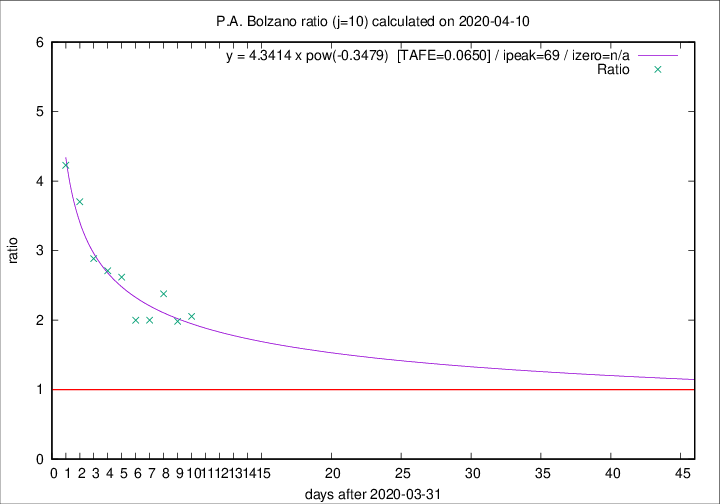

# P.A. Bolzano

Data source: https://raw.githubusercontent.com/pcm-dpc/COVID-19/master/dati-json/dpc-covid19-ita-regioni.json

Delta days analysis (j): 10

Analyses for other values of j for 2020-04-10 are avalable [here](../2020-04-10/README.md)

Analyses for P.A. Bolzano for previous dates are avalable [here](../README.md)

## Fitting 
|fit type|best fit equation|tafe|tfe|ipeak|izero|
|-------|-----|--------|------|---|---|
|pow|y = 4.3414 x pow(-0.3479)  [TAFE=0.0650]|0.0650|0.0031|69|n/a|

## Data
|Date|Daily deaths|Cumulated deaths|Deaths in the last 10 days|Deaths in the 10 days before|ratio|
|----|----------|-----------|-------|--------------------|-----|
|2020-04-10|4|191|115|56|2.0536|
|2020-04-09|4|187|113|57|1.9825|
|2020-04-08|9|183|119|50|2.3800|
|2020-04-07|10|174|110|55|2.0000|
|2020-04-06|6|164|104|52|2.0000|
|2020-04-05|12|158|110|42|2.6190|
|2020-04-04|7|146|103|38|2.7105|
|2020-04-03|10|139|101|35|2.8857|
|2020-04-02|13|129|100|27|3.7037|
|2020-04-01|40|116|93|22|4.2273|

[Download data as CSV](COVID-19_p.a._bolzano_j10_2020-04-10.csv)

Generated April 12th, 2020 at 17:02:01 UTC+0200 with https://github.com/robianc/COVID-19
