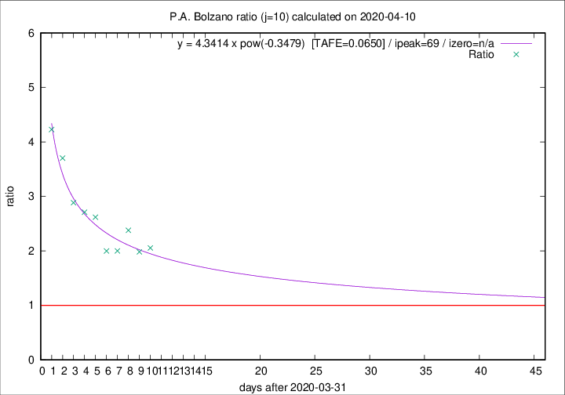
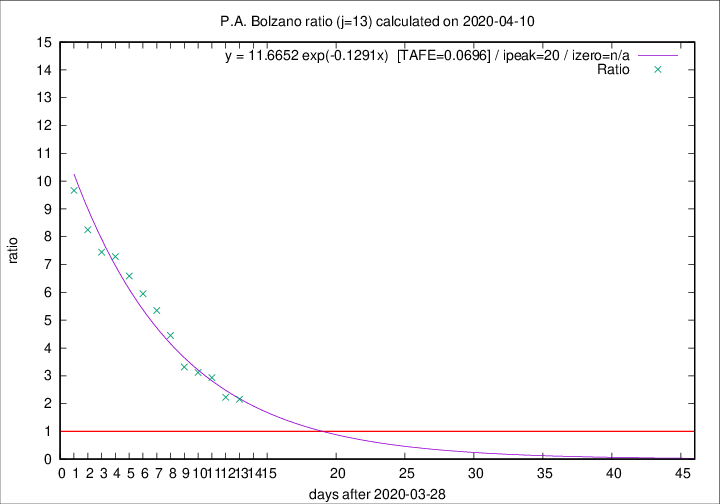

# P.A. Bolzano

Data source: https://raw.githubusercontent.com/pcm-dpc/COVID-19/master/dati-json/dpc-covid19-ita-regioni.json

Estimates in this page were made on 10/4/2020 with data available until 10/04/2020.

## Summary 

### Peak estimate 
|j|linear [TAFE]|exponential [TAFE]|power law [TAFE]|details|
|---|----|-----------|---------|-------|
|7|11/4/2020 [TAFE=0.2528]|10/4/2020 [TAFE=0.2318]|10/4/2020 [TAFE=0.3443]|[analysis](COVID-19_p.a._bolzano_j7_2020-04-10.md)|
|8|12/4/2020 [TAFE=0.2468]|12/4/2020 [TAFE=0.2473]|17/4/2020 [TAFE=0.3118]|[analysis](COVID-19_p.a._bolzano_j8_2020-04-10.md)|
|9|15/4/2020 [TAFE=0.1622]|15/4/2020 [TAFE=0.1700]|14/5/2020 [TAFE=0.1990]|[analysis](COVID-19_p.a._bolzano_j9_2020-04-10.md)|
|10|14/4/2020 [TAFE=0.1283]|19/4/2020 [TAFE=0.1019]|9/6/2020 [TAFE=0.0650]|[analysis](COVID-19_p.a._bolzano_j10_2020-04-10.md)|
|11|14/4/2020 [TAFE=0.1230]|19/4/2020 [TAFE=0.1043]|-|[analysis](COVID-19_p.a._bolzano_j11_2020-04-10.md)|
|12|13/4/2020 [TAFE=0.1218]|18/4/2020 [TAFE=0.1019]|14/6/2020 [TAFE=0.1508]|[analysis](COVID-19_p.a._bolzano_j12_2020-04-10.md)|
|13|12/4/2020 [TAFE=0.0692]|18/4/2020 [TAFE=0.0696]|13/6/2020 [TAFE=0.1898]|[analysis](COVID-19_p.a._bolzano_j13_2020-04-10.md)|
|14|11/4/2020 [TAFE=0.1989]|18/4/2020 [TAFE=0.1056]|9/6/2020 [TAFE=0.2014]|[analysis](COVID-19_p.a._bolzano_j14_2020-04-10.md)|

Best estimator is pow with j=10 (TAFE=0.0650)
Corresponding peak date estimate is 9/6/2020 (ipeak 69)

Peak date range estimate: 1/4/2020 - 16/6/2020

### End estimate 
|j|linear [TAFE/TFE]|exponential [TAFE/TFE]|power law [TAFE/TFE]|details|
|---|----|-----------|---------|-------|
|7|14/4/2020 [TAFE=0.2528]|-|-|[analysis](COVID-19_p.a._bolzano_j7_2020-04-10.md)|
|8|18/4/2020 [TAFE=0.2468]|-|-|[analysis](COVID-19_p.a._bolzano_j8_2020-04-10.md)|
|9|21/4/2020 [TAFE=0.1622]|-|-|[analysis](COVID-19_p.a._bolzano_j9_2020-04-10.md)|
|10|19/4/2020 [TAFE=0.1283]|-|-|[analysis](COVID-19_p.a._bolzano_j10_2020-04-10.md)|
|11|18/4/2020 [TAFE=0.1230]|-|-|[analysis](COVID-19_p.a._bolzano_j11_2020-04-10.md)|
|12|15/4/2020 [TAFE=0.1218]|-|-|[analysis](COVID-19_p.a._bolzano_j12_2020-04-10.md)|
|13|14/4/2020 [TAFE=0.0692]|-|-|[analysis](COVID-19_p.a._bolzano_j13_2020-04-10.md)|
|14|-|-|-|[analysis](COVID-19_p.a._bolzano_j14_2020-04-10.md)|

Best estimator is linear with j=13 (TAFE=0.0692)
Corresponding end date estimate is 14/4/2020 (izero 16)

End date range estimate: 29/3/2020 - 17/4/2020

Generated April 10th, 2020 at 17:26:10 UTC+0200 with https://github.com/robianc/COVID-19
