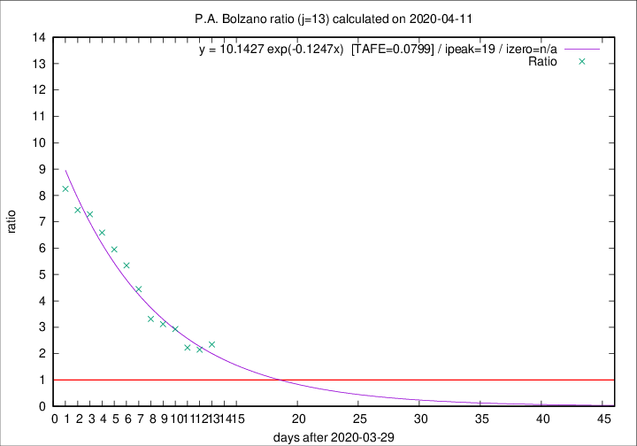

# P.A. Bolzano

Data source: https://raw.githubusercontent.com/pcm-dpc/COVID-19/master/dati-json/dpc-covid19-ita-regioni.json

Estimates in this page were made on 12/4/2020 with data available until 11/04/2020.

## Summary 

### Peak estimate 
|j|linear [TAFE]|exponential [TAFE]|power law [TAFE]|details|
|---|----|-----------|---------|-------|
|7|11/4/2020 [TAFE=0.2782]|10/4/2020 [TAFE=0.1938]|10/4/2020 [TAFE=0.2122]|[analysis](COVID-19_p.a._bolzano_j7_2020-04-11.md)|
|8|12/4/2020 [TAFE=0.2493]|11/4/2020 [TAFE=0.2432]|12/4/2020 [TAFE=0.3367]|[analysis](COVID-19_p.a._bolzano_j8_2020-04-11.md)|
|9|13/4/2020 [TAFE=0.2066]|13/4/2020 [TAFE=0.2166]|20/4/2020 [TAFE=0.2751]|[analysis](COVID-19_p.a._bolzano_j9_2020-04-11.md)|
|10|14/4/2020 [TAFE=0.1561]|16/4/2020 [TAFE=0.1557]|5/5/2020 [TAFE=0.1677]|[analysis](COVID-19_p.a._bolzano_j10_2020-04-11.md)|
|11|14/4/2020 [TAFE=0.1296]|19/4/2020 [TAFE=0.0916]|27/5/2020 [TAFE=0.0760]|[analysis](COVID-19_p.a._bolzano_j11_2020-04-11.md)|
|12|14/4/2020 [TAFE=0.1293]|19/4/2020 [TAFE=0.1022]|19/6/2020 [TAFE=0.1650]|[analysis](COVID-19_p.a._bolzano_j12_2020-04-11.md)|
|13|13/4/2020 [TAFE=0.0989]|18/4/2020 [TAFE=0.0799]|5/6/2020 [TAFE=0.1727]|[analysis](COVID-19_p.a._bolzano_j13_2020-04-11.md)|
|14|13/4/2020 [TAFE=0.1249]|18/4/2020 [TAFE=0.0899]|12/6/2020 [TAFE=0.2342]|[analysis](COVID-19_p.a._bolzano_j14_2020-04-11.md)|

Best estimator is pow with j=11 (TAFE=0.0760)
Corresponding peak date estimate is 27/5/2020 (ipeak 56)

Peak date range estimate: 6/4/2020 - 20/6/2020

### End estimate 
|j|linear [TAFE/TFE]|exponential [TAFE/TFE]|power law [TAFE/TFE]|details|
|---|----|-----------|---------|-------|
|7|14/4/2020 [TAFE=0.2782]|-|-|[analysis](COVID-19_p.a._bolzano_j7_2020-04-11.md)|
|8|16/4/2020 [TAFE=0.2493]|-|-|[analysis](COVID-19_p.a._bolzano_j8_2020-04-11.md)|
|9|18/4/2020 [TAFE=0.2066]|-|-|[analysis](COVID-19_p.a._bolzano_j9_2020-04-11.md)|
|10|19/4/2020 [TAFE=0.1561]|-|-|[analysis](COVID-19_p.a._bolzano_j10_2020-04-11.md)|
|11|18/4/2020 [TAFE=0.1296]|-|-|[analysis](COVID-19_p.a._bolzano_j11_2020-04-11.md)|
|12|17/4/2020 [TAFE=0.1293]|-|-|[analysis](COVID-19_p.a._bolzano_j12_2020-04-11.md)|
|13|15/4/2020 [TAFE=0.0989]|-|-|[analysis](COVID-19_p.a._bolzano_j13_2020-04-11.md)|
|14|-|-|-|[analysis](COVID-19_p.a._bolzano_j14_2020-04-11.md)|

Best estimator is linear with j=13 (TAFE=0.0989)
Corresponding end date estimate is 15/4/2020 (izero 16)

End date range estimate: 30/3/2020 - 16/4/2020

Generated April 12th, 2020 at 17:02:01 UTC+0200 with https://github.com/robianc/COVID-19
