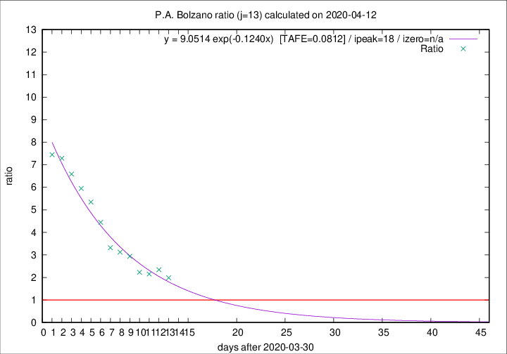

# P.A. Bolzano

Data source: https://raw.githubusercontent.com/pcm-dpc/COVID-19/master/dati-json/dpc-covid19-ita-regioni.json

Estimates in this page were made on 12/4/2020 with data available until 12/04/2020.

## Summary 

### Peak estimate 
|j|linear [TAFE]|exponential [TAFE]|power law [TAFE]|details|
|---|----|-----------|---------|-------|
|7|11/4/2020 [TAFE=0.3648]|10/4/2020 [TAFE=0.2106]|10/4/2020 [TAFE=0.1771]|[analysis](COVID-19_p.a._bolzano_j7_2020-04-12.md)|
|8|12/4/2020 [TAFE=0.2401]|11/4/2020 [TAFE=0.2037]|11/4/2020 [TAFE=0.2727]|[analysis](COVID-19_p.a._bolzano_j8_2020-04-12.md)|
|9|13/4/2020 [TAFE=0.2147]|12/4/2020 [TAFE=0.2240]|14/4/2020 [TAFE=0.3128]|[analysis](COVID-19_p.a._bolzano_j9_2020-04-12.md)|
|10|14/4/2020 [TAFE=0.1779]|14/4/2020 [TAFE=0.1922]|22/4/2020 [TAFE=0.2606]|[analysis](COVID-19_p.a._bolzano_j10_2020-04-12.md)|
|11|14/4/2020 [TAFE=0.1450]|16/4/2020 [TAFE=0.1323]|2/5/2020 [TAFE=0.1502]|[analysis](COVID-19_p.a._bolzano_j11_2020-04-12.md)|
|12|14/4/2020 [TAFE=0.1499]|19/4/2020 [TAFE=0.0875]|20/5/2020 [TAFE=0.0880]|[analysis](COVID-19_p.a._bolzano_j12_2020-04-12.md)|
|13|14/4/2020 [TAFE=0.1344]|18/4/2020 [TAFE=0.0812]|24/5/2020 [TAFE=0.1454]|[analysis](COVID-19_p.a._bolzano_j13_2020-04-12.md)|
|14|13/4/2020 [TAFE=0.1658]|19/4/2020 [TAFE=0.0944]|30/5/2020 [TAFE=0.2215]|[analysis](COVID-19_p.a._bolzano_j14_2020-04-12.md)|

Best estimator is exp with j=13 (TAFE=0.0812)
Corresponding peak date estimate is 18/4/2020 (ipeak 18)

Peak date range estimate: 4/4/2020 - 31/5/2020

### End estimate 
|j|linear [TAFE/TFE]|exponential [TAFE/TFE]|power law [TAFE/TFE]|details|
|---|----|-----------|---------|-------|
|7|14/4/2020 [TAFE=0.3648]|-|-|[analysis](COVID-19_p.a._bolzano_j7_2020-04-12.md)|
|8|15/4/2020 [TAFE=0.2401]|-|-|[analysis](COVID-19_p.a._bolzano_j8_2020-04-12.md)|
|9|17/4/2020 [TAFE=0.2147]|-|-|[analysis](COVID-19_p.a._bolzano_j9_2020-04-12.md)|
|10|19/4/2020 [TAFE=0.1779]|-|-|[analysis](COVID-19_p.a._bolzano_j10_2020-04-12.md)|
|11|18/4/2020 [TAFE=0.1450]|-|-|[analysis](COVID-19_p.a._bolzano_j11_2020-04-12.md)|
|12|-|-|-|[analysis](COVID-19_p.a._bolzano_j12_2020-04-12.md)|
|13|16/4/2020 [TAFE=0.1344]|-|-|[analysis](COVID-19_p.a._bolzano_j13_2020-04-12.md)|
|14|-|-|-|[analysis](COVID-19_p.a._bolzano_j14_2020-04-12.md)|

Best estimator is linear with j=13 (TAFE=0.1344)
Corresponding end date estimate is 16/4/2020 (izero 16)

End date range estimate: 31/3/2020 - 16/4/2020

Generated April 12th, 2020 at 16:28:18 UTC+0200 with https://github.com/robianc/COVID-19
