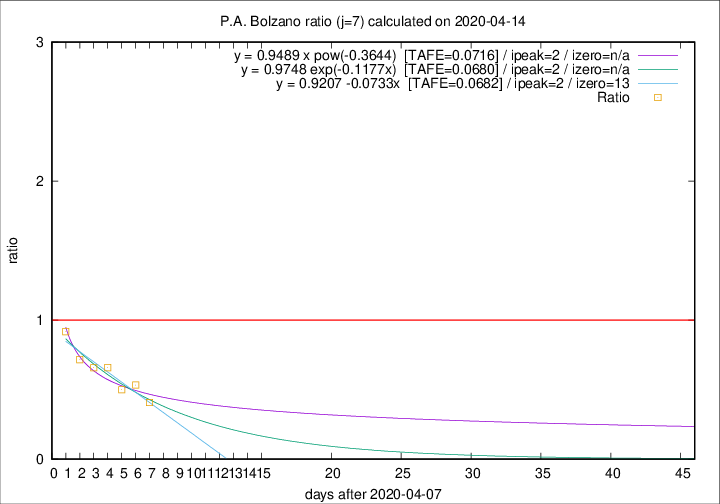

# P.A. Bolzano

Data source: https://raw.githubusercontent.com/pcm-dpc/COVID-19/master/dati-json/dpc-covid19-ita-regioni.json

Estimates in this page were made on 19/4/2020 with data available until 14/04/2020.

## Summary 

### Peak estimate 
|j|linear [TAFE]|exponential [TAFE]|power law [TAFE]|details|
|---|----|-----------|---------|-------|
|7|10/4/2020 [TAFE=0.0682]|10/4/2020 [TAFE=0.0680]|10/4/2020 [TAFE=0.0716]|[analysis](COVID-19_p.a._bolzano_j7_2020-04-14.md)|
|8|12/4/2020 [TAFE=0.3248]|11/4/2020 [TAFE=0.1963]|11/4/2020 [TAFE=0.1394]|[analysis](COVID-19_p.a._bolzano_j8_2020-04-14.md)|
|9|13/4/2020 [TAFE=0.2529]|12/4/2020 [TAFE=0.1865]|12/4/2020 [TAFE=0.2430]|[analysis](COVID-19_p.a._bolzano_j9_2020-04-14.md)|
|10|14/4/2020 [TAFE=0.1886]|13/4/2020 [TAFE=0.1886]|14/4/2020 [TAFE=0.2867]|[analysis](COVID-19_p.a._bolzano_j10_2020-04-14.md)|
|11|15/4/2020 [TAFE=0.1456]|14/4/2020 [TAFE=0.1806]|18/4/2020 [TAFE=0.2945]|[analysis](COVID-19_p.a._bolzano_j11_2020-04-14.md)|
|12|15/4/2020 [TAFE=0.1275]|16/4/2020 [TAFE=0.1414]|24/4/2020 [TAFE=0.2154]|[analysis](COVID-19_p.a._bolzano_j12_2020-04-14.md)|
|13|15/4/2020 [TAFE=0.1674]|18/4/2020 [TAFE=0.1157]|3/5/2020 [TAFE=0.1639]|[analysis](COVID-19_p.a._bolzano_j13_2020-04-14.md)|
|14|15/4/2020 [TAFE=0.2514]|19/4/2020 [TAFE=0.1016]|11/5/2020 [TAFE=0.1049]|[analysis](COVID-19_p.a._bolzano_j14_2020-04-14.md)|

Best estimator is exp with j=7 (TAFE=0.0680)
Corresponding peak date estimate is 10/4/2020 (ipeak 2)

Peak date range estimate: 10/4/2020 - 18/5/2020

### End estimate 
|j|linear [TAFE/TFE]|exponential [TAFE/TFE]|power law [TAFE/TFE]|details|
|---|----|-----------|---------|-------|
|7|21/4/2020 [TAFE=0.0682]|-|-|[analysis](COVID-19_p.a._bolzano_j7_2020-04-14.md)|
|8|-|-|-|[analysis](COVID-19_p.a._bolzano_j8_2020-04-14.md)|
|9|-|-|-|[analysis](COVID-19_p.a._bolzano_j9_2020-04-14.md)|
|10|-|-|-|[analysis](COVID-19_p.a._bolzano_j10_2020-04-14.md)|
|11|-|-|-|[analysis](COVID-19_p.a._bolzano_j11_2020-04-14.md)|
|12|-|-|-|[analysis](COVID-19_p.a._bolzano_j12_2020-04-14.md)|
|13|-|-|-|[analysis](COVID-19_p.a._bolzano_j13_2020-04-14.md)|
|14|-|-|-|[analysis](COVID-19_p.a._bolzano_j14_2020-04-14.md)|

Best estimator is linear with j=7 (TAFE=0.0682)
Corresponding end date estimate is 21/4/2020 (izero 13)

End date range estimate: 8/4/2020 - 23/4/2020

Generated April 19th, 2020 at 18:42:39 UTC+0200 with https://github.com/robianc/COVID-19
