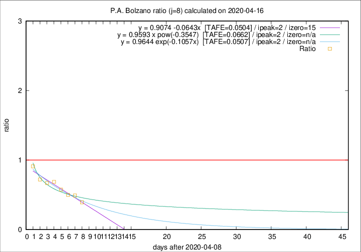

# P.A. Bolzano

Data source: https://raw.githubusercontent.com/pcm-dpc/COVID-19/master/dati-json/dpc-covid19-ita-regioni.json

Delta days analysis (j): 8

Analyses for other values of j for 2020-04-16 are avalable [here](../2020-04-16/README.md)

Analyses for P.A. Bolzano for previous dates are avalable [here](../README.md)

## Fitting 
|fit type|best fit equation|tafe|tfe|ipeak|izero|
|-------|-----|--------|------|---|---|
|linear|y = 0.9074 -0.0643x  [TAFE=0.0504]|0.0504|0.0022|2|15|
|exp|y = 0.9644 exp(-0.1057x)  [TAFE=0.0507]|0.0507|0.0014|2|n/a|
|pow|y = 0.9593 x pow(-0.3547)  [TAFE=0.0662]|0.0662|0.0037|2|n/a|

## Data
|Date|Daily deaths|Cumulated deaths|Deaths in the last 8 days|Deaths in the 8 days before|ratio|
|----|----------|-----------|-------|--------------------|-----|
|2020-04-16|2|225|42|107|0.3925|
|2020-04-15|9|223|49|100|0.4900|
|2020-04-14|2|214|50|100|0.5000|
|2020-04-13|7|212|54|94|0.5745|
|2020-04-12|5|205|59|86|0.6860|
|2020-04-11|9|200|61|91|0.6703|
|2020-04-10|4|191|62|86|0.7209|
|2020-04-09|4|187|71|78|0.9103|

[Download data as CSV](COVID-19_p.a._bolzano_j8_2020-04-16.csv)

Generated April 19th, 2020 at 18:42:39 UTC+0200 with https://github.com/robianc/COVID-19
